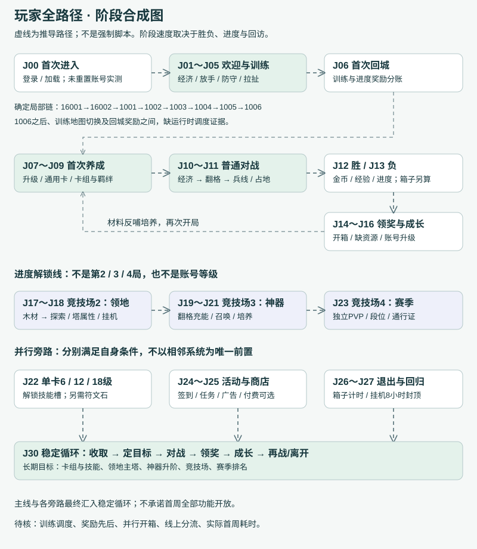

# 占城大师｜新手玩家全路径研究

从首次进入，到能独立安排“打一局、领材料、做成长、等回访”的完整旅程。

研究日期：2026-09-03。微信 AppID：`wx9eed71970378b2ae`；本地包目录版本16；资源清单版本`1.4.15.558-preview`。本报告独立于既有全系统拆解，不覆盖旧成果。

## 1. 结论先行：真正的新手路径是什么

新手旅程不是依次参观所有系统，而是**先通过受控翻格理解局内因果，再把战斗奖励转成第一次永久增强，随后用竞技场进度逐步加入领地、神器和赛季**。宝箱等待、材料不足、账号升级、签到任务会从旁打断或延长这条主线，最终形成多次短会话的成长循环。

目前证据可支持的主骨架是：进入与训练 → 首次回城/升级 → 普通竞技场反复对战 → 奖励和卡组调整 → 竞技场2领地 → 竞技场3神器 → 竞技场4赛季分流 → 日常收取与长期培养。**这不是一条已完整录像证实的强制脚本**：训练有两份地图方案，宝箱有5组教程方案，功能规则的教程起点字段全部为空，具体切换点由未恢复的运行时调度决定。

几个直接影响结论的重要发现：

- `GlobalTutorialInfo（全局教程流程信息）`共116节点，87条后继/条件候选边，0条悬空边。`nextId（后继编号）`证明局部顺序，不能按ID大小串联。欢迎16001实际指回基础教学1001。
- `GlobalFeatureUnlockInfo（全局功能解锁信息）`33行的`tutorialStartId（教程入口编号）`全为空。功能门槛可以分析，但不能从该表直接宣布“解锁后必播教程6001”。
- `startTriggerEvent（开始阶段事件字段）`含暂停、设置UI状态等动作，`endTriggerEvent（结束阶段事件字段）`含恢复、相机移动、结束标记。**更像教程进入/退出时执行的回调，不能未经代码证实把它们当订阅条件**。
- 首次卡牌升级可能早于首场正式对局；首次箱子也可能来自训练/进入竞技场节点，而非首胜。现有证据不能把“首胜→第一箱→第一次升级”写成唯一顺序。
- 竞技场2/3/4是功能门槛；账号2级的100经验是另一条线；卡牌6/12/18级技能又是第三条线。三者不能混用。
- 默认开关优先支持底部宝箱、新竞技场进度、新神器、新技能分支；多数来源为默认值，不等于当前服务器分流已证实。

## 2. 证据等级与阅读方式

| 标记 | 含义 | 本报告如何使用 |
| --- | --- | --- |
| 画面继承 | 已有研究直接看到的界面，本轮引用已有记录 | 8/43图鉴、竞技场1进度9/25与成功+3、领地竞技场2、赛季竞技场4、4箱槽和5分钟低级箱；不称本轮重新实测 |
| 静态配置 | 当前快照中的表、文本、UI目标与奖励字段 | 给出原表、ID、字段；能说明配置意图，不能代替线上调度 |
| 网上官方 | 官方发行页、Dofunny官方版主说明 | 核对产品、核心规则和宣传定位；不替代微信当前开关 |
| 网上社区 | 攻略、体验反馈、视频索引 | 提供策略/痛点线索，记录日期/平台；不把体验因果当规则 |
| 分析推导 | 由门槛、资源时钟与行为关系推算 | 明确假设；路径图中的阶段关系、首日/首周安排主要属于此类 |
| 待验证 | 根教程调度、实际入账、广告播放与恢复等 | 有缺口就显示缺口，不填成“必定如此” |

本轮未重置账号、清缓存、重放新号流程、购买、看广告或消耗稀有道具；未新增游戏实战截图。网上视频只核到页面/索引的，明确标“未观看”。研究读取范围为任务目录中的相关配置与既有报告；输出仅保留游戏规则相关开关白名单，不导出SDK凭据。

本报告是本地离线研究文档，路径图为文档内容，不另建网站、不在线发布。

## 3. 全路径图：主线、支路与回归

图中虚线表示跨阶段的合成路径/可选分流，不代表已恢复的程序调用；表内确定教学链另在图下注明。J编号是本报告节点索引，**不是游戏教程ID**。技能、活动与退出回归属于条件旁路，不以领地或神器为唯一前置。

### 3.1 三种顺序要分开

| 顺序层次 | 例子 | 能否断言先后 |
| --- | --- | --- |
| 表内脚本顺序 | 16001→16002→1001→1002→1003→1004→1005→1006 | 可以；仅1006之后无表内后继 |
| 条件候选顺序 | 12004→12005→1014，或14003→1014 | 前一边需AB条件选择；布尔极性和调用器未核 |
| 产品阶段顺序 | 训练结束→首次回城→普通竞技场→领地→神器→赛季 | 大阶段有条件支持，但中间可以插入领奖、开箱、升级、活动和退出 |

### 3.2 首次循环不是从首胜才开始

基础训练使用固定金矿和兵营，地图1另配骷髅战士9份奖励；升级教学直接指向骷髅战士卡及升级按钮。这个组合支持“先示范战斗，再给足第一次养成材料”的设计推断。与此同时，训练奖杯节点有稀有通用卡6份，进入竞技场1节点有金币60、宝石10、木箱；它们可能属于不同进度分支或不同领取时点。不能把这些表行相加后宣称新手开局固定拿到全部。

基础8张可用卡的线索是：金矿1001、熊战士1002、骷髅战士1003、弓箭手1004、步兵1005、幼龙1011、龙骑士1013、箭塔1014在`GlobalHeroCardInfoSheet5（全局英雄卡牌信息·Sheet5）`的`cardUnlockLevel（卡牌解锁等级字段，实际条件待核）`均为1，训练敌方卡组也使用这8张，既有账号显示8/43。**这形成初始集合候选，不是已核实的玩家初始化写入代码**；敌方牌组本身不能用作玩家拥有清单。

## 4. 教程触发链审计：如何从表还原，而不是猜顺序

### 4.1 关键字段及可推导边界

| 原字段（释义） | 当前快照特征 | 解释/边界 |
| --- | --- | --- |
| `id（教程编号）` | 1001～30004分散编号 | 用作标识，不作时间线 |
| `nextId（后继编号）` | 多个局部链，含2001→11001和11003→2003 | 建立明确候选边；遇到条件字段还需按条件标注 |
| `nextIdCondition（条件分支后继编号，推测）` | 12004/13004/14003/15003非空 | 值是目标教程ID，不是条件表达式；条件提供者在另一字段 |
| `useNextIdCondition（后继条件判断函数/配置引用，推测）` | 5行引用新手AB判断 | 1013正常后继1014但条件后继为空，不能无条件串上 |
| `startTriggerEvent（开始阶段事件字段）` | 1001为PauseGame；18004为TutorOpenUnchartBegin；30003为ChestTutorialFreeGet | 分别提示暂停、未知格教学开始、教学免费开箱特例；准确执行时机仍需调用代码 |
| `endTriggerEvent（结束阶段事件字段）` | 1001恢复；1006标记结束；1007相机看敌塔 | 不同于“等待此事件才开始”；同名首尾不自动构成订阅链 |
| `tutorialActionType（交互类型枚举）` | 0共68、1共1、2共47 | 按文本/目标推定：0目标点击、1拖拽、2说明确认。枚举代码未恢复，不能据此保证全局不可跳过 |
| `maskPoints（蒙版/聚焦目标）` | UI路径或取世界坐标方法 | 证明引导指哪里，不证明那个入口当时一定开放 |
| `maskType（蒙版类型参数）` | 0/0.5/1/2 | 不把数值强行解释成透明度或强制度 |
| `slideAnimPoints（拖拽动画起终点）` | 仅20002有技能图标到战场指示 | 与唯一拖拽动作相互印证 |
| `tutorialContent（本地化内容键）` | 1个键1020未匹配到中文 | 不自行补文案；空键的步骤用UI目标理解 |

`SDKModule.ABTestManager.Instance.NewbieTutorialIsBTest（新手教程B测试判定引用）`不等于`NewbieTutorial（新手教程默认开关）`数值本身。即使缓存为0，也不能未查实现就断言“为false，必走A链”。

### 4.2 已恢复的全部教学模块

| 模块 | 确定子链/候选链 | 入口证据与未连接处 |
| --- | --- | --- |
| 欢迎+基本经济 | 16001→16002→1001→1002→1003→1004→1005→1006 | 16001是图论根；具体首启调度未知；1006之后断开 |
| 战斗目标/放手 | 1007；1008 | 两个孤立调用节点，不按编号补成1006→1007→1008 |
| 卡牌升级/开打 | 1009→1010→1011→1012→1013；1014 | 1013→1014受AB引用影响；结束事件不等于保证立刻开打 |
| 传奇/羁绊 | 1015；1016→1017→1018→1019；1020；1021 | 1015与1016同名事件只能作为关联线索；1020文案缺失；1021旧神器规则 |
| 旧神器介绍 | 2001→11001→11002→11003→2003；2002→2003 | 不是2001→2002；旧每局一次说明不套新版 |
| 旧召唤教学 | 3001→3002→3003→3004；3005→3006→3007 | 3004到3005缺运行时领奖后桥接；3006固定指向战争号角3002仅作旧教学线索 |
| 领地双方案 | 4001→4002→4003→4004→4005；6001→6002→6003→6004→6005 | 旧/新UI分支，不能连续拼成两次必修 |
| 士气/旧通行证/赛季 | 5001～5005；7001→7002；8001→8002 | 开放门槛与活动/默认开关需额外核对 |
| 通用卡领取与兑换 | 9001→9002→9003；9004→9005→9006→9007→9008→9009 | 前链指向训练完成奖励领取，后链进入卡牌详情并确认兑换；两链之间无显式桥接，不是两个互斥方案。9008说明碎片满足，不是强制再升一级 |
| 新技能 | 10001→10002 | 指向技能入口、说明符文石；未明确强制花费 |
| 独立宝箱面板 | 12001→12002→12003→12004；13001→13002→13003→13004 | 条件候选尾为12005/13005→1014 |
| 底部宝箱 | 14001→14002→14003；15001→15002→15003 | 条件候选尾直达1014；队列UI与非队列UI并存 |
| 防御/僵局 | 17001→17002；17003；18001→18002→18003→18004 | 缺17002→17003及17003→18001桥接，靠地图和事件作高相关推断 |
| 拉扯训练 | 19001→19002；19003→19004→19005→19006→19007；19008 | 与Sheet1地图3对应；三段之间无直接边 |
| 新版神器局内 | 20000→20001；20002 | 充能完成调度20002缺显式条件；次数由文本明确 |
| 神器更新说明 | 20003→20004→20005→20006→20007→20008→20009→20010→20011→20012→20013→20014 | 文案是功能已更新，末尾资源返还事件；可能迁移老玩家，不能认定新号必修 |
| 快速开箱教学 | 30001→30002→30003→30004 | 30003开始事件提示教学免费特例；不确认真实播放广告 |

完整116行中文内容、目标路径和每条边在文末附录与`tutorial-graph.json（教程图数据）`中保留。34个无入边节点仅叫“图论根”，不是34次首登弹窗。

### 4.3 两版训练地图的差别

| 场景 | Sheet1配置 | Sheet2配置 | 对玩家旅程的影响 |
| --- | --- | --- | --- |
| 地图1 | 矩形8×16；玩家100/敌50；固定矿1001和熊战士1002；奖励骷髅战士9份 | 同布局，玩家150/敌50，同奖励 | 初始预算差50，可能改变等待与自由翻格空间；不能跨表相加 |
| 地图2 | 桥形14×14；玩家100/敌100；防御塔/矿/未知格龙骑士；敌前两动作间隔0/0.05 | 矩形8×16；双方50；多兵营与传奇配置 | 新增防守经济、僵局与未知格教学的依据主要来自Sheet1 |
| 地图3 | 桥形14×14；玩家50/敌200；敌骷髅巨人；己方弓箭手、未知格、塔 | 不存在 | 拉扯训练不一定面向所有新号 |

两表的`tutorialSteps（教程步骤字段）`全部为空。Sheet1地图2的固定龙骑士格配置含`TutorOpenUnchartBegin（未知格教学开始事件名）`，相机限制解除项含`TutorOpenUnchartEnd（未知格教学结束事件名）`；地图3相机解除项对应`TutorAttractionStrategyEnded（拉扯教学结束事件名）`。这些是**场景与教学子链关联的强证据**，但不是两场必按顺序播放的完整调度器。

## 5. 阶段节点总表与逐节点操作

以下先给可扫读总表，再给每个节点的进入条件、画面、操作、资源、即时/延期奖励、下一步与失败/不足/退出支路。具体实现无法支持的部分均在节点内标明。

|节点|阶段/玩家目标|触发与证据|下一步|
|---|---|---|---|
|[J00 首次启动与账号建立](#J00)|进入|推导入口＋静态文本；未重置账号实测|J01；若直接到主界面，按未完成教程状态由运行时调度，不能断言是异常。|
|[J01 欢迎与进入训练](#J01)|训练|明确教程边；入口调度待验证|J02。静态实线为16001→16002→1001。|
|[J02 第一次产钱、翻矿、翻兵营](#J02)|训练|明确教程链＋两版训练地图|1006结束回调SteerOpenHexEnd（翻格引导结束，推测）→运行时续播/放手；J03并非由1006的nextId直接相连。|
|[J03 训练战斗放手与胜利目标](#J03)|训练|静态节点；与J02的调用连接未恢复|按选中训练分支进入J04/J05或返回主界面J06；不把所有训练表行视为必经关。|
|[J04 防守发育、僵局与未知格](#J04)|训练分支|Sheet1地图2与教程的内容/坐标关联；不是已证实必经第2局|可能出现1015传奇自动技能说明；转J05或J06依运行时分支。|
|[J05 引流、拉扯与侧路偷袭](#J05)|训练分支|仅Sheet1有地图3；明确子链，根调度未知|结束回调TutorAttractionStrategyEnded/TutorStrategyEnded（拉扯/策略教学结束，推测），再回主循环J06/J10。|
|[J06 训练奖励与第一份成长预算](#J06)|首次回城|三套奖励来源并列；领取时序未确认|J07；J08/J14可由分支插入，未确认固定总顺序。|
|[J07 首次升级骷髅战士](#J07)|首次养成|明确点击链；AB后继不确定|J10或插入J14；按条件分支，不断言首箱一定在首次正式战斗前/后。|
|[J08 通用卡领取与补足碎片](#J08)|首次养成|领取链＋兑换链；两链之间的运行时桥接待核|J07/J15/J22；9009明确把更多通用卡来源指向活动或商店。|
|[J09 首次查看羁绊与调整卡组](#J09)|首次养成|明确羁绊教学；首次换卡动作是可选推导|J10/J11，用真实局面检验搭配。|
|[J10 第一次从主界面开始普通竞技场](#J10)|正式对局|点击链与既有主界面；不是独立PVP首局|J11。|
|[J11 自主局内循环：经济、兵线和胜利选择](#J11)|正式对局|教程规则＋静态数值；操作策略为推导|胜J12、负J13、离线J26。|
|[J12 首次正式胜利：到账与未到账分离](#J12)|结算|普通竞技场数值＋宝箱/结算文本|J14；若经验≥门槛到J16，若本竞技场进度满到J17/J19/J23。|
|[J13 首次失败：经验保留与回流选择](#J13)|结算|基础失败配置＋失败礼包文本；未实测失败结算|J15/J09/J10；自主暂停则J26。|
|[J14 首次宝箱：领到、解锁、开启是三步](#J14)|开箱|5组教程分支＋既有4槽/5分钟画面|材料够→J07/J22；不够→J15；等待→J10或J26。部分AB分支明确回1014继续匹配。|
|[J15 升级/探索/召唤资源不足时分流](#J15)|资源卡点|不足文本与消费规则；跳转优先级为推导|回对应培养节点，或J10继续竞技场；可以直接J26退出。|
|[J16 第一次账号升级与获得新卡机会](#J16)|账号成长|经验门槛与奖励行；起始奖励消费点未知|J09/J14/J10。|
|[J17 竞技场2：首次领地探索](#J17)|领地开放|界面解锁门槛＋两组教程|J18，并回J10体验成长反馈。|
|[J18 挂机领取与木材再投资](#J18)|领地成长|称号速率与上限；领取调度未实测|J07/J17/J21；资源未够→J26稍后回归。|
|[J19 竞技场3：第一次认识神器](#J19)|神器开放|功能表/奖励节点；解锁过程未实测|J20/J21/J10。|
|[J20 第一次充能完成并拖拽释放](#J20)|神器战斗|新版教程明确规则；当前账号尚未实战验证|J11继续战斗；结算后J21调整培养。|
|[J21 召唤、升级与升星形成材料循环](#J21)|神器成长|新旧教学区分；更新补偿不视为新号奖励|J20验证战斗效果，J18补水晶，J24看活动材料。|
|[J22 第一次跨过卡牌6级技能门槛](#J22)|卡牌技能|新技能价格表＋提示链；非账号6级|J11试用；缺符文石J15/J24/J25。|
|[J23 竞技场4：从普通爬场分流到独立PVP](#J23)|赛季开放|既有锁定画面＋PVP开放参数|J24任务、J30日常；仍可回J10推进竞技场。|
|[J24 签到、日任务与阶段奖进入玩家视野](#J24)|活动曝光|奖励表明确，首次曝光/启用日期未知|J15补缺口/J22培养，或J10继续对战；首周路径见报告。|
|[J25 从资源需求进入商店/礼包/广告](#J25)|商店曝光|基础门槛与商品表；主动弹窗时点未证|获得资源回培养；关闭继续J10/J26。|
|[J26 训练中、战斗中、主界面退出的差别](#J26)|退出|断线文本＋状态推导；不实测破坏账号|J27回归。|
|[J27 第一次回归：收取、整理、再开局](#J27)|回归|资源时钟支持的合理路径；无完整回归录屏|J30稳定循环；若目标未解锁继续J10。|
|[J30 稳定循环与长期目标](#J30)|稳定日常|系统规则综合推导；非承诺首周全部达到|J10/J23→J12/J13→J14/J18/J24→J07/J17/J21/J22→再战，周期性经过J26/J27。|

### J00 · 首次启动与账号建立

推导入口＋静态文本；未重置账号实测

|维度|玩家路径说明|
|---|---|
|进入条件|首次打开微信小游戏、资源加载与账号登录成功。登录方式、授权弹窗、实名弹窗出现顺序没有录屏证据。|
|玩家看到什么|进入游戏并加载主场景；本地有登录失败文本，但不能由此还原每个启动弹窗。|
|操作步骤|打开小游戏→等待加载→在实际出现的合法登录/授权界面自行完成→进入训练或主界面。|
|强制或自主|平台入口由玩家自主；训练是否可跳过未确认。|
|资源/时间消耗|网络、加载时间；没有证据证明入场需扣金币或体力。资源表存在耐力不等于当前玩法使用体力。|
|即时结果与奖励|账号状态初始化。局外金币20005默认100、宝石20006默认5、经验20007默认0，只是默认值，不是已核实首登录礼包。|
|延期奖励与后效|训练完成后进入成长循环；未确认另有强制首登奖励。|
|传达的规则|这是账号持续成长的入口，局内金币与局外金币不要混账。|
|下一步|J01；若直接到主界面，按未完成教程状态由运行时调度，不能断言是异常。|
|失败/不足/退出分支|登录失败→重试/退出；加载中退出→续载与教程恢复点未知。不能用清缓存验证。|
|卡点与设计作用|加载等待及多层授权可能在玩法价值出现前造成流失。设计作用是建立持续身份。|
|可追溯证据|[GlobalBaseAssetsInfo](../../tables/GlobalBaseAssetsInfo.json)#20003,20005,20006,20007（全局基础资源信息）:defaultValue（默认值）；[I2Terms](../../tables/I2Terms.json)#LoginFailed,Login_Failed（本地化文本词条）|

### J01 · 欢迎与进入训练

明确教程边；入口调度待验证

|维度|玩家路径说明|
|---|---|
|进入条件|运行时选择教程16001。该节点在静态图中无前驱，但这不等于确定的首启函数。|
|玩家看到什么|欢迎语→开始训练对战→聚焦领主塔。|
|操作步骤|确认16001、16002说明→到1001。|
|强制或自主|说明型引导；是否允许跳过整段未确认。|
|资源/时间消耗|只读说明，无明确资源消耗。|
|即时结果与奖励|进入受控的训练教学段。|
|延期奖励与后效|后续训练奖励另在J06处理。|
|传达的规则|先学习战斗，不先学习商店和完整养成。|
|下一步|J02。静态实线为16001→16002→1001。|
|失败/不足/退出分支|中断/退出后的重播位置未确认；不应把缺少跳过字段写成一定不可跳过。|
|卡点与设计作用|两次说明确认后才操作，提供语境但也增加首个有效动作前的等待。|
|可追溯证据|[GlobalTutorialInfo](../../tables/GlobalTutorialInfo.json)#16001,16002,1001（全局教程流程信息）:nextId（后继编号）,tutorialActionType（交互类型）|

### J02 · 第一次产钱、翻矿、翻兵营

明确教程链＋两版训练地图

|维度|玩家路径说明|
|---|---|
|进入条件|J01到1001，或调度器直接进入1001。|
|玩家看到什么|领主塔高亮→金币栏→指定金矿地块→金矿→一星格→产兵建筑。|
|操作步骤|读主塔产金币→读购买规则→点指定金矿格→观察矿产金币→点一星格→观察单位自动攻击。|
|强制或自主|1003、1005是目标点击型强指向；其余为说明型。蒙版存在，整体跳过能力未知。|
|资源/时间消耗|地图1的初始局内金币：Sheet1=100、Sheet2=150；一星基础格价50，两个指定格若均采用该价共100。实际训练扣费/特殊矿价未核。|
|即时结果与奖励|战场多出金矿与兵营，开始产生可见经济/兵线反馈；不是局外获得同名卡牌。|
|延期奖励与后效|矿带来后续翻格预算，兵营带来占地和胜利机会。|
|传达的规则|自动经济→投入→自动产兵→继续投入；玩家控制建设位置，不逐个操纵士兵。|
|下一步|1006结束回调SteerOpenHexEnd（翻格引导结束，推测）→运行时续播/放手；J03并非由1006的nextId直接相连。|
|失败/不足/退出分支|金币不足→等产出；指定按钮不可点→是否暂停、补资源或纠错待查。退出恢复未知。|
|卡点与设计作用|先给矿再给兵让玩家在低风险环境建立因果。两个地图版本的预算不同，会影响是否需要等待。|
|可追溯证据|[GlobalTutorialInfo](../../tables/GlobalTutorialInfo.json)#1001-1006（全局教程流程信息）:maskPoints（聚焦目标）,startTriggerEvent（开始阶段事件字段）,endTriggerEvent（结束阶段事件字段）；[GlobalTrainingMapInfoSheet1](../../tables/GlobalTrainingMapInfoSheet1.json)#1（训练地图信息·Sheet1）;[GlobalTrainingMapInfoSheet2](../../tables/GlobalTrainingMapInfoSheet2.json)#1（训练地图信息·Sheet2）:playerInitialCoin（玩家初始局内金币）,hexConfigs（固定格子配置）；[GlobalHexInfo](../../tables/GlobalHexInfo.json)（全局六边形地块信息）|

### J03 · 训练战斗放手与胜利目标

静态节点；与J02的调用连接未恢复

|维度|玩家路径说明|
|---|---|
|进入条件|调度到1007/1008；相机转向敌方或训练进程达到指定阶段，精确触发条件缺失。|
|玩家看到什么|摧毁敌方所有建筑的目标说明、敌方主塔、继续游戏提示。|
|操作步骤|确认说明→继续翻格→观察自动对抗→完成训练场景。|
|强制或自主|说明之后推导为自主练习；不能保证训练必胜。|
|资源/时间消耗|局内金币与操作时间。|
|即时结果与奖励|理解攻击方向和战斗结束目标。|
|延期奖励与后效|训练完成奖励见J06；1008结束事件名称提示可能显示卡牌概率面板，未确认真实显示内容。|
|传达的规则|兵营不是即时伤害按钮，部队需要产出与行进。|
|下一步|按选中训练分支进入J04/J05或返回主界面J06；不把所有训练表行视为必经关。|
|失败/不足/退出分支|训练失败的重试、奖励发放与教程跳转未找到明确脚本；记录为待验证，不假设免费复活。|
|卡点与设计作用|从强指向点击转向自由操作是第一次能力检验。若目标解释只讲拆建筑，会遗漏超时占地路径，J04承担补充。|
|可追溯证据|[GlobalTutorialInfo](../../tables/GlobalTutorialInfo.json)#1007,1008（全局教程流程信息）:endTriggerEvent（结束阶段事件字段）；[I2Terms](../../tables/I2Terms.json)#SteerTutorialContent_1007（本地化文本词条）|

### J04 · 防守发育、僵局与未知格

Sheet1地图2与教程的内容/坐标关联；不是已证实必经第2局

|维度|玩家路径说明|
|---|---|
|进入条件|若选择Sheet1地图2，存在防御塔、矿、桥形地形与未知格教学素材；17001、17003、18001之间无直接后继边。|
|玩家看到什么|周边缺兵营的防御局面→连续两座塔→矿→僵局提示→顶部占地计时→未知格；另有龙骑士教学配置。|
|操作步骤|17001→17002点两塔；调度17003点矿；18001→18002→18003→18004讲超时占地并点未知格。|
|强制或自主|指定点击与说明交替，阶段之间由未恢复的运行时调度。|
|资源/时间消耗|Sheet1地图2玩家/敌方初始局内金币100/100；连续点击成本是否由教学补钱承接待核。未知格基础价25。|
|即时结果与奖励|固定防线、经济建筑及未知格反馈；传奇演示不等于永久赠送传奇卡。|
|延期奖励与后效|将防守创造的时间转成经济和占地优势。|
|传达的规则|拆不动也可比占地；先防守后经济是一种情境策略，推翻无条件先矿的攻略模板。|
|下一步|可能出现1015传奇自动技能说明；转J05或J06依运行时分支。|
|失败/不足/退出分支|另一份Sheet2地图2为矩形且双方50金币，不能套用此桥形脚本；早胜、早败如何打断教学未知。|
|卡点与设计作用|敌人初始两次翻格间隔0/0.05，形成脚本化压力；教学把危险转成可控的策略演示。时间单位依运行时未核。|
|可追溯证据|[GlobalTrainingMapInfoSheet1](../../tables/GlobalTrainingMapInfoSheet1.json)#2（训练地图信息·Sheet1）:enemyFlipIntervals（敌方翻格间隔序列）,dragonKnightConfig（龙骑士教学配置）,cameraLimitBounds（相机限制/释放事件配置）；[GlobalTrainingMapInfoSheet2](../../tables/GlobalTrainingMapInfoSheet2.json)#2（训练地图信息·Sheet2）；[GlobalTutorialInfo](../../tables/GlobalTutorialInfo.json)#17001-17003,18001-18004,1015（全局教程流程信息）|

### J05 · 引流、拉扯与侧路偷袭

仅Sheet1有地图3；明确子链，根调度未知

|维度|玩家路径说明|
|---|---|
|进入条件|若进入Sheet1地图3及190xx策略训练；Sheet2没有第3条地图。|
|玩家看到什么|敌方骷髅巨人→我方兵营→两个右侧未知格→防御塔→敌军路线改变→左路偷袭提示。|
|操作步骤|19001→19002点兵营；另由调度进入19003→19004→19005→19006→19007；19008提示从左侧继续扩张。|
|强制或自主|前段指定位置操作，末段自主执行。|
|资源/时间消耗|玩家初始50、敌方200局内金币；桥形固定布局。每步是否等待自然收入未知。|
|即时结果与奖励|新建筑吸引无目标单位，给己方远程争取输出窗口。|
|延期奖励与后效|侧翼兵线可能绕过主战场推进基地。|
|传达的规则|无攻击目标的单位优先受直线距离最近建筑吸引；不等于所有已锁定单位立刻改目标。|
|下一步|结束回调TutorAttractionStrategyEnded/TutorStrategyEnded（拉扯/策略教学结束，推测），再回主循环J06/J10。|
|失败/不足/退出分支|跳过该训练的玩家可能从未系统学习拉扯；退出恢复、场景失败均未确认。|
|卡点与设计作用|这是位置策略的高价值教学，但它作为哪批玩家必经内容尚不确定。|
|可追溯证据|[GlobalTrainingMapInfoSheet1](../../tables/GlobalTrainingMapInfoSheet1.json)#3（训练地图信息·Sheet1）:enemyFlipHexSeq（敌方翻格顺序）,cameraLimitBounds（相机限制配置）；[GlobalTutorialInfo](../../tables/GlobalTutorialInfo.json)#19001-19008（全局教程流程信息）|

### J06 · 训练奖励与第一份成长预算

三套奖励来源并列；领取时序未确认

|维度|玩家路径说明|
|---|---|
|进入条件|训练完成、奖励/主界面出现。|
|玩家看到什么|训练完成奖励、初始卡牌、升级提示；既有账号界面记录为8/43图鉴。|
|操作步骤|确认训练奖励→检查卡牌和材料→进入升级引导。另有9001→9002→9003指向竞技场进度页的训练完成奖励领取按钮，支持通用卡训练奖的领取路径，但与骷髅升级教学的桥接未恢复。|
|强制或自主|领取/说明可能引导；精确弹窗栈未知。|
|资源/时间消耗|领取本身无已知消耗。|
|即时结果与奖励|训练地图1配置1003:9（骷髅战士9份）；奖杯训练节点0配置20012:6（稀有通用卡6）；竞技场1进入节点1000另有金币60、宝石10、木箱4001。三者不视为必定同时发放。|
|延期奖励与后效|用于首次升级、通用卡兑换或首箱体验；何时真实到账须看奖励领取。|
|传达的规则|训练奖励、进入竞技场节点奖、胜利掉落属于不同账目。|
|下一步|J07；J08/J14可由分支插入，未确认固定总顺序。|
|失败/不足/退出分支|发现数量不一致→核对奖励来源/是否已领，而非推断丢奖励；满槽如何放入节点箱未知。|
|卡点与设计作用|确定性材料托底可避免刚教会升级就因碎片不足而卡住；地图奖励与训练进度奖励是否同时发放、先后如何仍需验证。|
|可追溯证据|[GlobalTrainingMapInfoSheet1](../../tables/GlobalTrainingMapInfoSheet1.json)#1,[GlobalTrainingMapInfoSheet2](../../tables/GlobalTrainingMapInfoSheet2.json)#1（训练地图信息两版）:gameTutorEndReward（训练结束奖励）；[GlobalTrophyProgressInfo](../../tables/GlobalTrophyProgressInfo.json)#0,1000（奖杯进度与节点奖励信息）；既有报告2.2（上一轮界面8/43，非本轮首启实测）|

### J07 · 首次升级骷髅战士

明确点击链；AB后继不确定

|维度|玩家路径说明|
|---|---|
|进入条件|调度教程1009；若玩家有升级预算可执行。训练奖励支持这一设计，但无直接J06→1009表内边。|
|玩家看到什么|卡牌页→骷髅卡详情→升级按钮→关闭→战斗页。|
|操作步骤|1009→1010→1011升级→1012关闭→1013返回战斗；1014开始匹配是带AB条件的候选后继。|
|强制或自主|强指向点击，1011确实指向升级按钮，不只是说明。|
|资源/时间消耗|若骷髅战士为1级普通卡：公式需4份同卡＋5局外金币升2级。若初始等级/材料被覆盖，以界面为准。|
|即时结果与奖励|骷髅战士永久等级/属性成长；若9份是本分支已到账碎片且此前未消耗，第一次升级后剩5份。|
|延期奖励与后效|下局相应兵营/单位能力提升；继续升3级需9份及40金币，单靠剩余5份不足。|
|传达的规则|升级是双资源门槛：同卡碎片和金币缺一不可。|
|下一步|J10或插入J14；按条件分支，不断言首箱一定在首次正式战斗前/后。|
|失败/不足/退出分支|缺碎片→J08；缺金币→J15；教程强指向期间是否允许离开筹资未知。|
|卡点与设计作用|一次成功培养把战斗所得变成可见增强，下一次碎片缺口自然导向开箱与通用卡。|
|可追溯证据|[GlobalTutorialInfo](../../tables/GlobalTutorialInfo.json)#1009-1014（全局教程流程信息）；[GlobalHeroCardInfoSheet5](../../tables/GlobalHeroCardInfoSheet5.json)#1003（全局英雄卡牌信息）:upLevelRequireCount（升级卡牌份数公式）；[GlobalFormulasInfo](../../tables/GlobalFormulasInfo.json)#10010（全局数值公式信息）:priceFormula（价格公式）|

### J08 · 通用卡领取与补足碎片

领取链＋兑换链；两链之间的运行时桥接待核

|维度|玩家路径说明|
|---|---|
|进入条件|训练完成奖励可领取时进入9001；获得对应品质通用卡后可进入9004兑换教学。训练节点奖励为稀有通用卡，不能拿它补普通骷髅战士。|
|玩家看到什么|竞技场进度页的训练完成奖励→卡牌页/卡牌详情中的通用卡按钮→兑换确认→升级所需份数进度。|
|操作步骤|领取链9001→9002→9003，9003明确指向TrophyProgressItem_Training_Guid（训练进度项）的BtnClaimCompleteReward（领取完成奖励按钮）；兑换链9004→9005→9006→9007确认兑换→9008→9009。没有9003→9004的显式后继，不能保证连续自动播放。|
|强制或自主|教程内指向兑换确认；教程外兑换对象由玩家自主选。|
|资源/时间消耗|消耗对应品质通用卡；数量依兑换面板，不应假定教学一次兑换6份。|
|即时结果与奖励|领取端对应训练节点稀有通用卡6份的配置线索；兑换端增加已拥有、同品质目标卡的份数。9008为说明型，不能认定它又自动执行升级。|
|延期奖励与后效|与金币凑齐后才能真正升级。|
|传达的规则|通用卡补的是已拥有卡；随机新卡5017用于解锁收藏，两者不能替代。|
|下一步|J07/J15/J22；9009明确把更多通用卡来源指向活动或商店。|
|失败/不足/退出分支|品质不符/未拥有目标/数量不足→换合法目标或保留资源；没有确认无损撤销。|
|卡点与设计作用|把随机掉落转换为可定向投入，降低核心卡缺片挫折，同时增加资源规划要求。|
|可追溯证据|[GlobalTutorialInfo](../../tables/GlobalTutorialInfo.json)#9001-9009（全局教程流程信息）；[I2Terms](../../tables/I2Terms.json)#GameAssetUniversalCardR_Explain,GameAssetUniversalCardSR_Explain（本地化文本词条）；[GlobalBaseAssetsInfo](../../tables/GlobalBaseAssetsInfo.json)#20011-20014（全局基础资源信息）|

### J09 · 首次查看羁绊与调整卡组

明确羁绊教学；首次换卡动作是可选推导

|维度|玩家路径说明|
|---|---|
|进入条件|教程1016或玩家打开卡牌页；获得可用新卡后才有更广调整空间。|
|玩家看到什么|阵容区、兽人羁绊按钮、两名兽人激活一级协作的说明。|
|操作步骤|1016→1017看羁绊→1018读说明→1019查看全阵容；自主比较等级/角色/羁绊后换卡并回战斗试用。|
|强制或自主|查看羁绊由教程指向；没有看到强制换入某张新卡的完整步骤链。|
|资源/时间消耗|查看/普通装备无已知材料费；为新卡升级才花材料。|
|即时结果与奖励|阵容与羁绊预览改变；永久解锁卡不会因未装备而消失。|
|延期奖励与后效|改变下局翻格候选与组合效果；具体卡池抽取调用未恢复，不承诺指定格必出指定卡。|
|传达的规则|卡组不是八张最高稀有度堆叠，要考虑经济、近远程、出兵间隔与2/4/6种族档。|
|下一步|J10/J11，用真实局面检验搭配。|
|失败/不足/退出分支|想卸金矿时存在不要放弃金矿的提示，是否硬性禁止需确认；A/B羁绊文本不同，以当前面板为准。|
|卡点与设计作用|从照做升级转为有目标的自主构筑；传奇演示容易让新手误以为品质决定一切。|
|可追溯证据|[GlobalTutorialInfo](../../tables/GlobalTutorialInfo.json)#1016-1019（全局教程流程信息）；[I2Terms](../../tables/I2Terms.json)#CantEquipCardTip_GoldMine,HeroCardPanel_OrcsFettersBuff（本地化文本词条）；[GlobalHeroCardInfoSheet5](../../tables/GlobalHeroCardInfoSheet5.json)（全局英雄卡牌信息）|

### J10 · 第一次从主界面开始普通竞技场

点击链与既有主界面；不是独立PVP首局

|维度|玩家路径说明|
|---|---|
|进入条件|训练已结束并到竞技场1，或1014被调用。没有证据把账号2级当作开打前置。|
|玩家看到什么|主界面竞技场、开始匹配按钮、宝箱槽和未解锁入口；既有界面进度9/25、成功+3。|
|操作步骤|检查卡组→点开始→等待匹配/加载→进入普通战场。|
|强制或自主|首次按钮有强指向，之后自主反复开局。|
|资源/时间消耗|时间；NoBet（免下注开关）默认1支持免下注分析，不把旧下注金额或耐力默认为当前入场费。|
|即时结果与奖励|生成新局内状态；普通竞技场1时限180秒配置。|
|延期奖励与后效|胜负分别推进J12/J13，后续账号经验和奖杯进度不同步。|
|传达的规则|此时是普通竞技场，不是竞技场4才开放的独立赛季PVP。|
|下一步|J11。|
|失败/不足/退出分支|匹配等待/取消/断线的精确策略未确认；训练敌方卡组与普通AI表都不能证明第一正式局必为真人或必胜机器人。|
|卡点与设计作用|等待与对手表现决定第一次从脚本训练到真实规则的落差。|
|可追溯证据|[GlobalTutorialInfo](../../tables/GlobalTutorialInfo.json)#1014（全局教程流程信息）:maskPoints（开始按钮目标）；[GlobalArenaInfoSheet2](../../tables/GlobalArenaInfoSheet2.json)#1001（全局竞技场信息）:countDownTime（倒计时）,trophyReward（胜利奖杯）；[RemoteConfig](../../tables/RemoteConfig.json)（远程配置缓存，仅默认值）:NoBet（免下注开关）|

### J11 · 自主局内循环：经济、兵线和胜利选择

教程规则＋静态数值；操作策略为推导

|维度|玩家路径说明|
|---|---|
|进入条件|普通对局加载完成。|
|玩家看到什么|金币、地块价格、兵营/矿/塔、敌方推进、计时与占地；神器未解锁时没有新增主动技能教学要求。|
|操作步骤|先观察近敌压力→分配金币→点相邻格→观察随机结果与兵线→按威胁补防御/经济→临近结束比较占地。|
|强制或自主|自主；不要求固定先翻三矿或单路推进。|
|资源/时间消耗|一星50、二星100、三星250、未知25局内金币；矿持续产出，敌压可能使玩家没有等待高价格的余裕。|
|即时结果与奖励|随机建筑/单位、占地和经济改变；没有确认局内剩余金币结转为局外余额。|
|延期奖励与后效|矿的复利、持续出兵、路线控制和拆建筑/占地胜利。|
|传达的规则|拆光敌方建筑或计时结束占地更多；平局判定未知。未知格权重向量不能直接解释成80%金卡。|
|下一步|胜J12、负J13、离线J26。|
|失败/不足/退出分支|局内缺钱→等产出/选择更低价合法格；不能打开局外金币商店就假定给本局补钱。僵局→占地路线，而非只赌传奇。|
|卡点与设计作用|随机惊喜＋持续反馈，失败也能诊断经济过慢、前线崩溃或占地不足，但无法由一次失败确定唯一原因。|
|可追溯证据|[GlobalHexInfo](../../tables/GlobalHexInfo.json)（全局六边形地块信息）；[GlobalTutorialInfo](../../tables/GlobalTutorialInfo.json)#1001-1007,18003,19003-19008（全局教程流程信息）；[GlobalArchitectureInfogameplay_improve_01](../../tables/GlobalArchitectureInfogameplay_improve_01.json)#1001（全局建筑信息）；[W02](#W02),[W03](#W03),[W06](#W06)（网上交叉证据，见来源表）|

### J12 · 首次正式胜利：到账与未到账分离

普通竞技场数值＋宝箱/结算文本

|维度|玩家路径说明|
|---|---|
|进入条件|普通竞技场1判胜，且当日金币额度未耗尽。未发现独立首胜加倍保证。|
|玩家看到什么|胜利结算、经验与进度变化、可能获得的箱子/空槽提示；胜利礼包广告入口有资源支持。|
|操作步骤|查看结算→确认返回→先启动宝箱解锁→检查账号/进度节点是否达标。|
|强制或自主|自主领取与可选广告；不能把可选礼包算必领。|
|资源/时间消耗|无已确认领奖手续费；广告耗时间且受可用性限制。|
|即时结果与奖励|基础金币5（首档日额度200）、经验20、奖杯+3；实际覆盖/保护/加成另核。拆建筑木材5/50是潜在旧公式分支，不计入固定首胜账。|
|延期奖励与后效|胜利宝箱在槽位允许时待解锁；账号升级、奖杯节点、任务达标后另领。|
|传达的规则|赢一局同时动多个进度条，但它们不是同一笔产出。|
|下一步|J14；若经验≥门槛到J16，若本竞技场进度满到J17/J19/J23。|
|失败/不足/退出分支|满槽→文本支持无空位，补偿/溢出保存未知；金币达日上限→不代表经验和奖杯也封顶。|
|卡点与设计作用|首胜给即时满足，箱子延期发材料形成回访钩子；满槽会让继续对战的收益感下降。|
|可追溯证据|[GlobalArenaInfoSheet2](../../tables/GlobalArenaInfoSheet2.json)#1001（全局竞技场信息）:victoryGoldNoBet（免下注胜利金币）,dailyGoldLimitNoBet（金币日上限）；[GameSettingConfig](../../tables/GameSettingConfig.json)#NormalPVPWinExp（游戏通用规则配置·普通胜利经验）；[I2Terms](../../tables/I2Terms.json)#SuccessPanel_NoEmptySpace（本地化文本词条）；[VideoBtnConfig](../../tables/VideoBtnConfig.json)#1009（激励视频入口配置）|

### J13 · 首次失败：经验保留与回流选择

基础失败配置＋失败礼包文本；未实测失败结算

|维度|玩家路径说明|
|---|---|
|进入条件|建筑/占地判负，或触发当前模式的断线失败规则。|
|玩家看到什么|失败结算、可能的失败礼包、返回/再次挑战相关界面；精确按钮顺序未录制。|
|操作步骤|确认结果→检查是经济、兵线还是占地问题→不必购买，回卡组/升级或再挑战。|
|强制或自主|自主；没有证据表明失败后必须消费才能继续。|
|资源/时间消耗|竞技场1失败扣奖杯基数2；零分保护、降场、首次免扣未核。|
|即时结果与奖励|普通失败经验配置10；失败金币与宝箱未确认，不能补成胜利一半。|
|延期奖励与后效|有资格的对局次数任务仍可能前进；胜场任务不因失败增加；账号经验允许缓慢升级。|
|传达的规则|输并非所有成长归零，但攀升速度会降低。士气教程的胜+5/负-20属于后续/旧分支，不套给初始账号。|
|下一步|J15/J09/J10；自主暂停则J26。|
|失败/不足/退出分支|VideoBtnConfig#1011有失败礼包入口，不证明每败必弹、礼包内容固定或必须看广告。连败保护/对手调整未证。|
|卡点与设计作用|失败后同时出现增强建议与变现入口，可能把策略问题误读成付费问题；需要区分玩家感受与匹配证据。|
|可追溯证据|[GameSettingConfig](../../tables/GameSettingConfig.json)#NormalPVPLoseExp（游戏通用规则配置·普通失败经验）；[GlobalArenaInfoSheet2](../../tables/GlobalArenaInfoSheet2.json)#1001（全局竞技场信息）:trophyPunish（失败扣减基数）；[I2Terms](../../tables/I2Terms.json)#DefeatPanel_DefeatPack,DefeatPanel_AFK（本地化文本词条）；[VideoBtnConfig](../../tables/VideoBtnConfig.json)#1011（激励视频入口配置）|

### J14 · 首次宝箱：领到、解锁、开启是三步

5组教程分支＋既有4槽/5分钟画面

|维度|玩家路径说明|
|---|---|
|进入条件|已有箱子，且调度器选择相应宝箱UI分支。它可能来自训练节点或首胜，不能仅凭文案确定哪一笔。|
|玩家看到什么|主界面槽位或独立宝箱面板→宝箱信息/空解锁栏→解锁按钮→计时→开箱结果。|
|操作步骤|当前底部方案候选14001→14002→14003；队列方案15001→15002→15003；快速教学30001→30002→30003→30004。旧独立面板为120xx/130xx。|
|强制或自主|教学内目标点击；日常等待/广告/宝石加速为自主选择。|
|资源/时间消耗|木箱等待5分钟配置；快速按钮可能消费广告/其他加速，但30003进入事件ChestTutorialFreeGet提示教学免费特例，不能认定第一次真的播放广告。|
|即时结果与奖励|开始计时，尚未得到内容物；完成开启才取得卡片和材料。|
|延期奖励与后效|木箱5、铁箱10、青铜30、黄金45、宝玉60、国王90、大师120、传奇180分钟配置；奖励编码与文本冲突未解决，不给固定箱内总额。|
|传达的规则|4个槽不是4个并行解锁位。竞技场4有宝箱队列解锁文本，实际并发数量待验证。|
|下一步|材料够→J07/J22；不够→J15；等待→J10或J26。部分AB分支明确回1014继续匹配。|
|失败/不足/退出分支|满槽/正在解锁→先看槽位状态；广告不可用→等自然计时，不保证免费重试次数；退出后的计时续走属于合理回访预期，仍待在线核对。|
|卡点与设计作用|第一箱缩短反馈间隔，后续时间拉长；再战与离开都成为合法下一步。|
|可追溯证据|[GlobalTutorialInfo](../../tables/GlobalTutorialInfo.json)#12001-15003,30001-30004（全局教程流程信息）；[GlobalBoxInfo](../../tables/GlobalBoxInfo.json)#4001-4008（全局宝箱信息）:unLockTime（解锁时间）；[GlobalTrophyProgressInfo](../../tables/GlobalTrophyProgressInfo.json)#1003（奖杯节点信息）:UnlockFunctionName（解锁功能名）；[VideoBtnConfig](../../tables/VideoBtnConfig.json)#1006（激励视频入口配置）|

### J15 · 升级/探索/召唤资源不足时分流

不足文本与消费规则；跳转优先级为推导

|维度|玩家路径说明|
|---|---|
|进入条件|玩家尝试升级卡牌、解锁技能、探索领地、神器培养或召唤时材料不够。|
|玩家看到什么|金币、木材、水晶、碎片、符文石不足提示或对应资源进度。|
|操作步骤|先确认缺的资源与用途→查已可领箱子/节点/任务→继续对战或领地收取→再决定是否看可选广告/兑换。|
|强制或自主|自主支路；没有配置证明必须购买。|
|资源/时间消耗|筹资耗时间；兑换可能消耗宝石/通用卡。不要为完成消耗任务而无目标花掉珍贵资源。|
|即时结果与奖励|领取/兑换到账；不足时原操作是否保证不扣部分材料须面板确认。|
|延期奖励与后效|箱子计时、挂机、下一日任务提供后续补充，不保证当场解决。|
|传达的规则|局外金币缺口靠局外来源；卡片缺口可用同品质通用卡；技能另要符文石；神器另要水晶/碎片。|
|下一步|回对应培养节点，或J10继续竞技场；可以直接J26退出。|
|失败/不足/退出分支|既没有合适通用卡也没有可领奖励→等待是可行选择；缺新卡不能用已拥有卡通用片解锁。广告失败不等于资源到账。|
|卡点与设计作用|多种资源把一条升级线分成数个门槛，促使玩家接触局外系统；若提示只导商店，会弱化免费来源的可理解性。|
|可追溯证据|[I2Terms](../../tables/I2Terms.json)#TipPanel_NotEnoughMoney,TipPanel_NotEnoughWood,TipPanel_NotEnoughDivineCrystal,TipPanel_NotEnoughNumber,AbilitySystem2_NotEnoughStone（本地化文本词条）；[GlobalShopInfo](../../tables/GlobalShopInfo.json)（全局商店信息）；[GlobalTutorialInfo](../../tables/GlobalTutorialInfo.json)#9009（全局教程流程信息）|

### J16 · 第一次账号升级与获得新卡机会

经验门槛与奖励行；起始奖励消费点未知

|维度|玩家路径说明|
|---|---|
|进入条件|账号经验达到2级100。若零经验起步、每胜20/负10且仅靠普通对战，需5胜到10负之间的5～10局。|
|玩家看到什么|账号等级提升、升级奖励/新卡或宝箱预览；当前既有界面60/100支持早期门槛。|
|操作步骤|确认升级→领取该等级奖励→检查新卡是否可入阵→按需调整J09。|
|强制或自主|经验累积自动，奖励是否自动发还是需点击领取待核。|
|资源/时间消耗|经验达到阈值；不是花同卡碎片升卡牌等级。|
|即时结果与奖励|GlobaUpgradeReward的ID2配置5017:1；5017从未拥有卡随机，品质权重40/30/20/10。精确应用行偏移/初始ID1是否已消费未实测。|
|延期奖励与后效|ID3木箱，ID4随机新卡，ID5木箱，ID6随机新卡。后续账号经验列究竟累计阈值还是逐级需求未定，不给精确一周等级。|
|传达的规则|账号等级、卡牌等级、竞技场档位是三条独立轴。新卡让收藏横向扩展，碎片让旧卡纵向成长。|
|下一步|J09/J14/J10。|
|失败/不足/退出分支|某品质未拥有池为空时回退规则未知；不能承诺任何等级必出指定卡，也不能把cardUnlockLevel数字直接当成该账号等级必送卡。|
|卡点与设计作用|输局仍得经验使收藏不断推进；但随机新卡未必能替换已培养主力。|
|可追溯证据|[UserLevelInfo](../../tables/UserLevelInfo.json)#10002（账号等级经验信息）:exp（经验字段）；[GlobaUpgradeReward](../../tables/GlobaUpgradeReward.json)#1-6（账号升级奖励配置）；[GlobalRandomHeroCardInfo](../../tables/GlobalRandomHeroCardInfo.json)#5017（随机英雄卡牌奖励信息）:randomFromOwnedCards（从已拥有卡抽取与否）,randomProbability（品质权重）；[GameSettingConfig](../../tables/GameSettingConfig.json)#NormalPVPWinExp,NormalPVPLoseExp（游戏通用规则配置）|

### J17 · 竞技场2：首次领地探索

界面解锁门槛＋两组教程

|维度|玩家路径说明|
|---|---|
|进入条件|普通竞技场1完成门槛25进度、进入竞技场2后，领地可解锁。具体进度溢出处理未知。|
|玩家看到什么|领地入口解除锁定→领主塔属性→可探索格。|
|操作步骤|进入领地→查看塔属性→点击指定可买格→用木材探索/建造→看属性变化。教程4001～4005或6001～6005，不是连续做两遍。|
|强制或自主|首次探索有强指向；后续探索路线自主。|
|资源/时间消耗|木材；首称号hexPrice=50是对应档位探索费用候选，实际首教学是否减免待核。|
|即时结果与奖励|建筑提供塔攻击、生命或局内金币产量加成；首格具体建筑需地图/界面复核，不能保证先加金币。|
|延期奖励与后效|领主塔更强、挂机材料流形成；奖励通行证另领，不与每次翻格合并。|
|传达的规则|领地不是装饰，是把木材转为对战塔属性及长期资源供给。|
|下一步|J18，并回J10体验成长反馈。|
|失败/不足/退出分支|木材不足→J15；旧400x引用旧主城界面，新600x引用新界面，默认开关无法单独证明当前播放哪套。|
|卡点与设计作用|从只关心卡牌转向全局底盘，资源维度首次显著增加。|
|可追溯证据|既有报告2.4（领地锁定页竞技场2）；[GlobalFeatureUnlockInfo](../../tables/GlobalFeatureUnlockInfo.json)#Feature_Fief（全局功能解锁信息）:type（类型）=2,args（参数）=2；[GlobalTutorialInfo](../../tables/GlobalTutorialInfo.json)#4001-4005,6001-6005（全局教程流程信息）；[GlobalMainCityTitleInfo](../../tables/GlobalMainCityTitleInfo.json)（领地称号与收益信息）|

### J18 · 挂机领取与木材再投资

称号速率与上限；领取调度未实测

|维度|玩家路径说明|
|---|---|
|进入条件|领地/挂机系统实际开放，积累时间达到可领要求；最低领取间隔未确认。|
|玩家看到什么|挂机收益累计、金币/木材/水晶与可能的翻倍入口。|
|操作步骤|回城检查→领取已累积资源→按需用木材探索→保留金币给核心卡、水晶给神器。|
|强制或自主|自主，广告翻倍不是普通领取必要条件。|
|资源/时间消耗|等待；进一步探索花木材。|
|即时结果与奖励|首档每分钟金币1、木材0.5、水晶0.125配置；领到多少取决于实际有效累计分钟和加成。|
|延期奖励与后效|上限480分钟；基础满8小时480金币/240木材/60水晶。更高称号提高速率，不能把8小时按一整天乘3算未登录收益。|
|传达的规则|存储有上限，领地探索与定期回访构成正反馈。|
|下一步|J07/J17/J21；资源未够→J26稍后回归。|
|失败/不足/退出分支|离线计时起点、服务器校时、广告翻倍失败补发未知；无证据存在额外离线补偿礼包。|
|卡点与设计作用|为短会话提供低操作收益；让玩家在不打完整对局时仍能感觉成长。|
|可追溯证据|[GlobalMainCityTitleInfo](../../tables/GlobalMainCityTitleInfo.json)（领地称号与基础收益信息）:maxRewardMins（挂机累计分钟上限）及收益字段；[VideoBtnConfig](../../tables/VideoBtnConfig.json)#1014（激励视频入口配置）:ReportLable（报告标签）=Idle_Double（挂机翻倍）|

### J19 · 竞技场3：第一次认识神器

功能表/奖励节点；解锁过程未实测

|维度|玩家路径说明|
|---|---|
|进入条件|竞技场3为核心门槛；召唤/卡牌子入口另有RequireUnlocked=1020，命名空间未知，不能解释为竞技场20。|
|玩家看到什么|神器入口、冲锋号角说明、装备区、召唤入口。|
|操作步骤|按实际引导进入神器页→看当前装备→回战斗。旧链2001→11001→11002→11003→2003；新版更新链20003～20014未证实是新号同一路径。|
|强制或自主|说明与目标点击；没有证据要求付费获得首件神器。|
|资源/时间消耗|看说明无消耗；首件冲锋号角的授予时点/数量未确认。|
|即时结果与奖励|拥有/装备主动技能载体；旧文案确认介绍冲锋号角，不代表当前号必收到同一默认件。|
|延期奖励与后效|新战斗维度J20，长期培养J21。|
|传达的规则|神器提供额外战术动作，不改变普通卡牌自动出兵的底层循环。|
|下一步|J20/J21/J10。|
|失败/不足/退出分支|子入口仍锁→核对前置完成而非只看竞技场数字；神器18件启用不等于立即都可收集。|
|卡点与设计作用|在基本翻格熟悉后加入主动技能，分散首场认知负担。|
|可追溯证据|[GlobalFeatureUnlockInfo](../../tables/GlobalFeatureUnlockInfo.json)#Feature_Artifacts,Feature_ArtifactsCard,Feature_ArtifactsSummon（全局功能解锁信息）；[GlobalTrophyProgressInfo](../../tables/GlobalTrophyProgressInfo.json)#1002（奖杯进度节点信息）；[GlobalTutorialInfo](../../tables/GlobalTutorialInfo.json)#2001,11001-11003,2003,20003-20014（全局教程流程信息）|

### J20 · 第一次充能完成并拖拽释放

新版教程明确规则；当前账号尚未实战验证

|维度|玩家路径说明|
|---|---|
|进入条件|装备可用神器进入对局，调度20000/20002；充能需翻格达到对应累计次数。|
|玩家看到什么|神器技能图标、充能状态与拖拽指示。|
|操作步骤|读20000→20001说明→持续翻格至第8次→充能完成时拖拽使用；之后累计到20、36次分别再充满。|
|强制或自主|首次释放有拖拽教学，其余时机和位置自主。|
|资源/时间消耗|充能依赖翻格投入局内金币与机会成本；没有证据每次释放扣局外宝石。|
|即时结果与奖励|对应神器效果作用于战场；未解析的目标范围、额外冷却不可补猜。|
|延期奖励与后效|每局最多3次；短局或经济不足可能根本达不到第二/三次。|
|传达的规则|8/20/36是累计翻格次数，后两段增量12/16；不是第8/20/36秒。|
|下一步|J11继续战斗；结算后J21调整培养。|
|失败/不足/退出分支|没充满→继续翻格或正常打完；拖放无效→目标/状态需界面核对；旧30秒/每局1次不并入新版。|
|卡点与设计作用|翻格同时推进经济、占地和技能充能，给主动决策明确节奏点。|
|可追溯证据|[GlobalTutorialInfo](../../tables/GlobalTutorialInfo.json)#20000-20002（全局教程流程信息）:tutorialActionType（交互类型）=1,slideAnimPoints（拖拽起终点）；[RemoteConfig](../../tables/RemoteConfig.json)（远程配置缓存）:NewArtifactsPlay（新版神器玩法开关）=1|

### J21 · 召唤、升级与升星形成材料循环

新旧教学区分；更新补偿不视为新号奖励

|维度|玩家路径说明|
|---|---|
|进入条件|神器与召唤入口已解锁，已有神器或相关材料。|
|玩家看到什么|升级、升星、召唤、十连/百连选项。|
|操作步骤|查看神器详情→查看升级和升星需求→选择可领免费/广告召唤或保留资源→按需提升→装备合适神器。|
|强制或自主|20006/20009/20012/20013是说明型，不代表脚本强制升级、升星、看广告或付费抽卡。|
|资源/时间消耗|升级水晶、升星碎片；新版教程每6小时可看广告免费十连，宝石十/百连另花宝石。具体价格与免费状态看当前面板。|
|即时结果与奖励|召唤取得水晶或神器相关材料，升级/升星改变属性；新手首抽是否固定战争号角不能由旧3006目标推为当前保证。|
|延期奖励与后效|召唤经验等级提高池子品质分布，升阶限制进一步升级；不是短期必满系统。|
|传达的规则|水晶、碎片、召唤经验三者角色不同；普通池与限定池不同。|
|下一步|J20验证战斗效果，J18补水晶，J24看活动材料。|
|失败/不足/退出分支|广告不可用→等待/退出；无宝石→不抽也可继续普通战斗；ArtifactResourceReturn事件更像版本迁移资源返还，不能当所有新号固定补偿。|
|卡点与设计作用|多个时钟与材料门槛制造中长期回访理由，也可能造成界面理解负担。|
|可追溯证据|[GlobalTutorialInfo](../../tables/GlobalTutorialInfo.json)#3001-3007,20003-20014（全局教程流程信息）；[GlobalSummonInfo](../../tables/GlobalSummonInfo.json)（全局神器召唤信息）；[PropUpgradeInfoConfig](../../tables/PropUpgradeInfoConfig.json)（神器等级升级配置）;[PropRankUpInfoConfig](../../tables/PropRankUpInfoConfig.json)（神器升星升阶配置）|

### J22 · 第一次跨过卡牌6级技能门槛

新技能价格表＋提示链；非账号6级

|维度|玩家路径说明|
|---|---|
|进入条件|某卡达到6级且存在对应技能；后续门槛12/18级。是否在达到时自动弹引导未确认。|
|玩家看到什么|卡牌额外技能入口、技能升级按钮、符文石余额/不足提示。|
|操作步骤|10001点击技能入口→10002读升级说明→自主比较效果与成本→有材料则升级技能。|
|强制或自主|教程强制看入口，第二步是说明型，不证明强制付符文石。|
|资源/时间消耗|首技能三档符文石100/200/300；第二技能300/600/900；第三技能600/1000/1500。卡牌1→6累计金币1125另算。|
|即时结果与奖励|购买技能档位才获得相应效果；仅卡牌到6级不等于技能已强化满。|
|延期奖励与后效|12/18级成为长期明确目标，改变培养优先级。|
|传达的规则|等级门槛＋符文石门槛叠加；不是所有卡都拥有相同数量技能。|
|下一步|J11试用；缺符文石J15/J24/J25。|
|失败/不足/退出分支|旧天赋树与新技能可能并存于资源，当前优先新系统；重置石是否返符文石未知，不用它试错验证。|
|卡点与设计作用|从纯数值升级转到能力变化，但高阶金币三次增长会显著拉长养成。|
|可追溯证据|[GlobalUpgradeTalentPriceInfoabilities_in_advance](../../tables/GlobalUpgradeTalentPriceInfoabilities_in_advance.json)（额外技能解锁与价格信息·提前开放分支）；[GlobalTutorialInfo](../../tables/GlobalTutorialInfo.json)#10001,10002（全局教程流程信息）；[GlobalCardTalent2Info](../../tables/GlobalCardTalent2Info.json)（卡牌与新技能对应信息）；[W07](#W07)（社区经验交叉核对）|

### J23 · 竞技场4：从普通爬场分流到独立PVP

既有锁定画面＋PVP开放参数

|维度|玩家路径说明|
|---|---|
|进入条件|竞技场4；Pvp_OpenMainLevel=4与界面一致。当前赛季是否已开放仍依服务器。|
|玩家看到什么|赛季入口、段位/排名、独立任务与通行证；旧8001→8002只说明进入赛季。|
|操作步骤|打开赛季规则→看段位与可领任务→自主选择PVP或继续普通竞技场→匹配对局。|
|强制或自主|解锁不等于强制改玩该模式。|
|资源/时间消耗|单局配置300秒上限，长于普通首档180秒；未确认额外入场费。|
|即时结果与奖励|分数基础胜+20/负-16（另有修正），新通行证经验胜100/负30；不是普通竞技场奖杯。|
|延期奖励与后效|段位、通行证与周期排名奖励，按达标/到期另领。Reward_Win=6含义未定，不能称每天6胜固定包。|
|传达的规则|模式换了，计分、时限和奖励账本也换了；首局机器人/固定图字段只可作为候选行为。|
|下一步|J24任务、J30日常；仍可回J10推进竞技场。|
|失败/不足/退出分支|Pvp_PlayFirstBot=1、Pvp_PlayFirstMap=1001提示独立PVP首局预设，不能外推所有对局；旧7002前50胜代币规则不替代新通行证100/30。|
|卡点与设计作用|增加竞技目标与周期间隔，但也产生普通进度和赛季进度的注意力竞争。|
|可追溯证据|[PvpSettingConfig](../../tables/PvpSettingConfig.json)（PVP全局规则配置）:Pvp_OpenMainLevel（开放竞技场等级）,PvpPlayTime（时限）,Pvp_PlayFirstBot（推测首局机器人标志）,Pvp_PlayFirstMap（推测首局地图）；[GlobalFeatureUnlockInfo](../../tables/GlobalFeatureUnlockInfo.json)#Feature_Season（全局功能解锁信息）；[GlobalTutorialInfo](../../tables/GlobalTutorialInfo.json)#7001-7002,8001-8002（全局教程流程信息）|

### J24 · 签到、日任务与阶段奖进入玩家视野

奖励表明确，首次曝光/启用日期未知

|维度|玩家路径说明|
|---|---|
|进入条件|相应活动实际开放且账号满足资格；不是看到本地表就认定首日全部开启。|
|玩家看到什么|签到日历、活动任务、活跃进度与奖励节点；具体红点/弹窗优先级未核。|
|操作步骤|领取当日可领签到→看任务是否随正常对战推进→达标手动领任务和阶段奖→选择参与活动。|
|强制或自主|可选分支，尤其消耗任务不应作为强制新手步骤。|
|资源/时间消耗|签到通常无材料费；比赛/胜场花时间；消耗金币/木材/宝石任务必须真的花资源；骰子活动花专属骰子。|
|即时结果与奖励|首签到组候选首日500金币；周卡活动10局任务500金币、5胜任务20宝石，各加10活跃。每项要满足对应资格与领取，不提前入账。|
|延期奖励与后效|签到累计7/14/28天奖励；周卡活跃50档50宝石、100档普通通用卡30等，奖励是达标节点，不是单局产出。|
|传达的规则|同一局可推进多个计数，但同一计数的任务是否阶段继承、何时重置依活动规则。|
|下一步|J15补缺口/J22培养，或J10继续对战；首周路径见报告。|
|失败/不足/退出分支|错过签到→有补签视频入口，次数/消耗/连续与累计口径未核；某活动未开放→跳过，不影响基本战斗。|
|卡点与设计作用|把自由对战转为今日短目标，同时把每周/每月目标接上；过多入口会分散第一次养成的注意力。|
|可追溯证据|[CheckInRewardsIndexConfig](../../tables/CheckInRewardsIndexConfig.json)#10001,10002（签到奖励组索引）;[CheckInRewardsConfig](../../tables/CheckInRewardsConfig.json)#1001（签到奖励配置）;[CumulativeRewardConfig](../../tables/CumulativeRewardConfig.json)（累计签到奖励配置）；[GlobalWeeklyCardDailyTaskInfo](../../tables/GlobalWeeklyCardDailyTaskInfo.json)#10001,10002（每周卡牌活动每日任务信息）;[GlobalWeeklyCardStageInfo](../../tables/GlobalWeeklyCardStageInfo.json)#10001,10002（每周卡牌活动阶段奖励信息）；[DailyTaskConfig](../../tables/DailyTaskConfig.json)#2（骰子冒险每日任务配置）;[VideoBtnConfig](../../tables/VideoBtnConfig.json)#1017（激励视频入口配置）|

### J25 · 从资源需求进入商店/礼包/广告

基础门槛与商品表；主动弹窗时点未证

|维度|玩家路径说明|
|---|---|
|进入条件|完成训练后基础商店资格；Feature_Store、Feature_NewBiePack等type=2,args=1。也可能由缺资源/结算/活动提示引入。|
|玩家看到什么|基础资源、特卖、新手/种族礼包、月卡/基金等入口；商品可见不等于强制购买。|
|操作步骤|看需求与售价/限购→比较免费可领、宝石兑换和真实付费→自主关闭或操作；本研究未购买。|
|强制或自主|自主；图标解锁、页面曝光、自动弹出、购买是四件事。|
|资源/时间消耗|GlobalShopInfo的priceResourceId分广告10001、内购10002、宝石20006等；平台真实币价不能由国际IAP的2.99换成人民币。|
|即时结果与奖励|符合条件并成功领取/交易才发奖励；新手礼包候选有金矿卡片、宝石、木材。|
|延期奖励与后效|分阶段新手礼包配置第1/2/3日奖，需先满足对应购买/领取条件；不是免费三日登录礼。|
|传达的规则|免费广告、宝石消费、现金消费分开；通行证高级轨不自动归零氪玩家所有。|
|下一步|获得资源回培养；关闭继续J10/J26。|
|失败/不足/退出分支|余额不足→保留资源/免费来源J15；支付失败/取消不应计入领取。UserLablePushPackInfo只有标签礼包内容，不能证明首败固定推送。|
|卡点与设计作用|将刚产生的材料缺口对应到可购买解法；延迟礼包把消费与后续回访绑定。|
|可追溯证据|[GlobalFeatureUnlockInfo](../../tables/GlobalFeatureUnlockInfo.json)#Feature_Store,Feature_NewBiePack,Feature_MonthlyCard,Feature_Fund（全局功能解锁信息）；[I2Terms](../../tables/I2Terms.json)#ShoPanel_CompleteGuidToUnlock（本地化文本词条）；[GlobalShopInfo](../../tables/GlobalShopInfo.json)#10001（全局商店信息）；[GlobaMultistageNewcomerPackageInfo](../../tables/GlobaMultistageNewcomerPackageInfo.json)#10001（分阶段新手礼包信息）|

### J26 · 训练中、战斗中、主界面退出的差别

断线文本＋状态推导；不实测破坏账号

|维度|玩家路径说明|
|---|---|
|进入条件|玩家关闭/切后台、网络断开或主动结束本次会话。|
|玩家看到什么|可能出现退出/断线提示；不同模式UI未逐一核对。|
|操作步骤|若已结算，启动可用宝箱计时并领取可领资源后离开；若战斗中，先知晓可能判负。|
|强制或自主|自主退出。|
|资源/时间消耗|战斗未完成有判负风险；训练进度是否丢失未知。主界面离开未发现直接罚资源证据。|
|即时结果与奖励|会话结束，不代表删除账号或重置成长。|
|延期奖励与后效|箱子/挂机可能继续计时；挂机有8小时存储上限。|
|传达的规则|DefeatPanel_AFK写断线超过10秒判负，TipTxt_1写长时间挂机超过10秒视为失败；后者不能解释成10秒不点格必输。适用模式/暂停行为需实测。|
|下一步|J27回归。|
|失败/不足/退出分支|训练退出→恢复节点未知；匹配退出→取消/计负未知；战斗退出→判负风险；开箱动画退出→到账幂等未知；主界面退出→常规回访。|
|卡点与设计作用|短局降低离开成本，但后台惩罚会影响碎片时间玩法；需要避免把离线文案与静止观察混为一谈。|
|可追溯证据|[I2Terms](../../tables/I2Terms.json)#DefeatPanel_AFK,TipTxt_1,Exit_Game（本地化文本词条）；[GlobalMainCityTitleInfo](../../tables/GlobalMainCityTitleInfo.json)（领地称号与基础收益信息）:maxRewardMins（累计时间上限）|

### J27 · 第一次回归：收取、整理、再开局

资源时钟支持的合理路径；无完整回归录屏

|维度|玩家路径说明|
|---|---|
|进入条件|重新打开同一账号；需要确认登录与资源同步成功。|
|玩家看到什么|宝箱完成状态、挂机累计、签到/活动可领状态、竞技场进度。回归专属礼包/强制弹窗没有确认。|
|操作步骤|先看箱子→领取完成箱并启动下一箱→领地已开则领挂机→看当天签到/任务→做一次有目标培养→再对战。|
|强制或自主|可选组织顺序，不是游戏强制脚本。|
|资源/时间消耗|收取时间；培养照常耗材料。|
|即时结果与奖励|把延期奖励转成可用材料；上次尚未结算/动画中的奖励先核账。|
|延期奖励与后效|补满下一次挂机/宝箱时钟，构成下一轮回访。|
|传达的规则|在线频率影响时钟利用率，但不等于必须每5分钟上线。|
|下一步|J30稳定循环；若目标未解锁继续J10。|
|失败/不足/退出分支|资源不同步/广告失败→不反复消费验证；错过活动周期→按当前规则处理，不能沿用旧奖励表。|
|卡点与设计作用|短回访也能获得明确进展；同时领取点过多可能让新手忘记本次主目标。|
|可追溯证据|[GlobalBoxInfo](../../tables/GlobalBoxInfo.json)（全局宝箱信息）;[GlobalMainCityTitleInfo](../../tables/GlobalMainCityTitleInfo.json)（领地称号与收益信息）;[CheckInRewardsIndexConfig](../../tables/CheckInRewardsIndexConfig.json)（签到奖励组索引）；推导：以上系统形成的回访顺序，不是直接教程边|

### J30 · 稳定循环与长期目标

系统规则综合推导；非承诺首周全部达到

|维度|玩家路径说明|
|---|---|
|进入条件|已会独立对战、领奖和培养，并有至少一条可持续材料来源；神器/赛季未开仍能形成基础循环。|
|玩家看到什么|近期竞技场目标、核心卡技能门槛、箱子/挂机、活动阶段、赛季奖励。|
|操作步骤|短登录收取→选择一个培养目标→普通竞技场或赛季对局→结算分账→补箱子计时→按周期领任务→退出。|
|强制或自主|自主分配游戏时间，玩家可以轻度只打几局，不必清空所有任务。|
|资源/时间消耗|战斗与广告时间、金币/碎片/符文石/木材/水晶等分线预算。|
|即时结果与奖励|战斗乐趣、阶段推进、资源到账与可见属性改善。|
|延期奖励与后效|核心卡6/12/18技能、扩展可用卡池、领地更高称号、神器升阶、20档竞技场与周期段位/通行证目标。|
|传达的规则|不是重复点击同一系统，而是材料约束决定下一条支路，局外选择反过来改变局内经济与战术。|
|下一步|J10/J23→J12/J13→J14/J18/J24→J07/J17/J21/J22→再战，周期性经过J26/J27。|
|失败/不足/退出分支|连败→先检查局内决策和培养分配；卡资源→等待/活动/缩小目标；活动未开→回基础循环；不把购买作为唯一路径。|
|卡点与设计作用|多层长期目标延长生命周期；若资源缺口同时堆叠，玩家会从策略学习转向等待与强度焦虑。|
|可追溯证据|本报告J10-J27的合成路径；[GlobalArenaInfoSheet2](../../tables/GlobalArenaInfoSheet2.json)（全局竞技场信息）;[GlobalUpgradeTalentPriceInfoabilities_in_advance](../../tables/GlobalUpgradeTalentPriceInfoabilities_in_advance.json)（额外技能门槛与价格信息）;[GlobalMainCityTitleInfo](../../tables/GlobalMainCityTitleInfo.json)（领地称号信息）;[PropRankUpInfoConfig](../../tables/PropRankUpInfoConfig.json)（神器升阶配置）|

## 6. 解锁门槛：用条件，不用臆造的第几分钟

| 门槛轴 | 条件与玩家变化 | 配置来源/证据等级 | 不应推成什么 |
| --- | --- | --- | --- |
| 训练完成/基础竞技场 | 商店、卡牌、战斗、月卡/基金、新手礼包等基础入口有资格 | 功能表对应行`type（规则类型）=2,args（规则参数）=1`；商店文本要求完成训练；部分基础界面已确认 | 不等于首登所有礼包弹窗必依次出现 |
| 普通竞技场2 | 领地与领地通行证资格 | `Feature_Fief（领地功能）`、`Feature_MainCityPass（领地通行证功能）`；锁定页确认 | 不是账号2级或第2次胜利 |
| 普通竞技场3 | 神器、神器卡/召唤资格 | `Feature_Artifacts（神器功能）`；子项`RequireUnlocked（前置解锁标识）=1020`；中文提示竞技场3解锁冲锋号角 | 1020命名空间不明，不能读作20竞技场或完成教程1020 |
| 普通竞技场4 | 赛季PVP；宝箱队列相关入口；士气/插屏资格字段 | PVP开放参数=4与界面一致；奖杯节点1003写宝箱队列；士气和插屏是否启用需另核 | 不等于第4局、所有广告必开始、4个并行箱位 |
| 账号2级 | 100经验门槛、随机新卡奖励行 | `UserLevelInfo（账号等级经验信息）`和`GlobaUpgradeReward（账号升级奖励配置）` | 不是卡牌2级；更高经验列仍有累计/逐级语义问题 |
| 单卡6/12/18级 | 额外技能入口，另需符文石 | `GlobalUpgradeTalentPriceInfoabilities_in_advance（额外技能门槛与价格信息·提前开放分支）` | 不等于账号等级；不是到级自动满技能 |
| 日/周活动条件 | 签到、活跃、累计天数、消耗任务、赛季天数 | 各自任务/奖励表 | 配置日期、活动编号、`type=6/7`参数不可机械读成第几天必开 |

`Feature_CycleGiftSystem（周期礼包功能）`的参数为`4;2;0;...`，`Feature_LegendCardWeekly（传奇卡周活动功能）`参数为`7;7;0;...`，`Feature_GiftChain（链式奖励功能）`的类型6/参数6，`Feature_GiftChain2（第二链式奖励功能）`类型6/参数5。**未恢复枚举和解析函数，不认定它们是“第6天礼包”“第7天周活动”**。

### 6.1 竞技场进度与老奖杯节点不是一套可直接叠加的刻度

| 阶段 | 当前场内完成进度字段 | 老奖杯节点表进入下一场的累计门槛 | 基础胜/负 | 时限 |
| --- | --- | --- | --- | --- |
| 场1→场2 | 25 | 25 | +3 / −2 | 180秒 |
| 场2→场3 | 75 | 100 | +6 / −4 | 190秒 |
| 场3→场4 | 100 | 200 | +9 / −6 | 200秒 |
| 场4→场5 | 200 | 400 | +12 / −8 | 210秒 |

前三段差值吻合累计表，但未确认新流程如何保留超额进度、降场/归零保护及节点奖沿用。既有画面9/25与场1配置一致；不能因此证明后续所有旧节点奖励都仍照发。`winCountUnLock（按胜场解锁字段，推测旧条件）`在场2为10，也不能与25进度再叠一个“必须10胜”门槛。

### 6.2 场次与时间估算（情景预算，不是实测分位数）

从零场1进度出发，假设只打普通竞技场、胜率在各场相同、无保护/加成/降场，阶段清零且不保留溢出，每局基础变化为`p×胜利增量−(1−p)×失败扣减`。用“门槛/净变化”估算预算并逐段向上取整；**这不是随机过程精确期望，也不是统计置信区间**。低分保护、顺序、过门槛溢出会使实际更短或更长。

| 情景 | 到场2累计局数 | 到场3累计局数 | 到场4累计局数 |
| --- | --- | --- | --- |
| 全胜、阶段独立清零 | 9 | 22 | 34 |
| 全胜、累计进度保留溢出 | 9 | 22 | 33 |
| 胜率80%的净漂移预算 | 13 | 32 | 49 |
| 胜率60%的净漂移预算 | 25 | 63 | 97 |

若含匹配/结算的平均对局占用假设为2～4.5分钟，训练及首次培养额外5～15分钟，则60%～80%情景下：领地约累计0.5～2.1小时，神器约1.2～5小时，赛季约1.7～7.5小时。这些是**主动游玩时间预算**，不是安装后自然流逝时间，不包括长广告、挂机等待和多次中断。低于此胜率、快速投降、服务器修正会超出区间。初始账号2级若只靠胜20/负10经验，则5～10局即可到100经验；因此它很可能早于领地，并不需要等到竞技场2。

当前继承账号9/25若不考虑失败与其他修正，再6胜可到27并越过25；这只是当前进度的计算示例，非本轮代打或保证。

## 7. 资源与奖励流转：每一笔何时才属于玩家

| 资源/进度 | 主要进入渠道 | 主要去向 | 入账时点与关键边界 |
| --- | --- | --- | --- |
| 局内金币 | 主塔/金矿等局内产出 | 买格、形成兵线、推进神器充能 | 不确认结算转为局外金币；训练初始币按场景表 |
| 局外金币20005 | 胜利基础值、箱子、挂机、任务、节点、可选广告/商店 | 卡牌升级 | 同一金币图标仍需分局内/局外账本 |
| 奖杯/场内进度 | 普通战斗胜负 | 竞技场资格与节点 | 不是可消费货币；与PVP段位分分开 |
| 账号经验20007 | 普通胜20/负10配置 | 账号升级 | 达标后升级奖另发，不能每局重复计算 |
| 同卡份数/通用卡20011～20014 | 训练、开箱、活动等 | 升卡，或先将同品质通用卡转成已拥有卡份数 | 不等于解锁任意新卡；训练稀有通用卡不能补普通骷髅 |
| 随机新卡5017 | 部分账号升级奖励行 | 扩大收藏与卡组候选 | 从未拥有池抽取；空池回退/可用卡过滤未确认 |
| 木材20008 | 箱子、挂机、任务；拆建筑旧公式候选 | 领地探索/属性 | 5×普通建筑+50×主城只是旧公式示例，不是固定单胜木材 |
| 符文石20018 | 活动、广告/商店相关来源 | 卡牌额外技能 | 到等级但没符文石仍不能完成相应强化 |
| 水晶20009 | 挂机、召唤、箱子/奖励 | 神器升级 | 与神器碎片的升星功能分开 |
| 神器碎片/召唤经验 | 召唤、活动、PVP条件奖励 | 升星/召唤等级 | 抽中相关材料不一定直接得到完整新神器 |
| 宝石20006 | 节点、活动、部分随机奖励、广告/购买 | 加速、召唤、定向兑换等 | 不把真钱价格、宝石价格和广告入口混为一种成本 |
| 新PVP通行证经验20024 | PVP胜100/负30与任务 | 通行证等级 | 旧代币20017、账号经验20007、段位分均不可相加 |
| 活动专属资源 | 如骰子任务/领取 | 各自活动循环 | 骰子每日任务不是通用每日任务；活动离场/换期处理未核 |

### 7.1 首胜到首次培养的一次账本示例

假设：普通场1、有金币额度、有空箱槽、无额外加成；不假设训练/节点奖是否已领取。

1. 判胜时，基础分账候选为局外金币+5、账号经验+20、竞技场进度+3。
2. 若发胜利箱，记为“箱子待解锁”，不是立刻记入碎片、木材、水晶。
3. 如果此局恰使经验达到100，账号升级奖励才成为另一条待领取/已领取记录；不是每次胜利都送新卡。
4. 若已有骷髅战士1级、4份同卡，花5金币和4份升2级；金币来自哪笔奖励不改变消费性质。
5. 开箱完成后再记实际内容物。如果额外完成10局任务或5胜任务，只在活动开放、达标、领取后记录，不追溯成各局固定报酬。

新手训练9份骷髅战士的算例：1→2需4份/5金币，剩5份；2→3需9份/40金币，差4份。这个小缺口解释了为什么“第一升很顺，下一升要找箱子/同品质通用卡”的节奏合理。它是基于公式的设计推断，不确认所有新号当前初始化等级为1。

### 7.2 免费、广告、付费不是同一路径

自然等待开箱、普通对战、已解锁领地收益构成基础路；奖励广告构成加速路；礼包/月卡/基金是付费路。任务可能鼓励消耗，但**没有证据表明必须付费才能继续普通对战或完成基础学习**。广告表有胜利包、失败包、减箱时间、资源、挂机翻倍、补签等入口；入口存在不证明每天次数、触发弹窗和具体奖励已在线核实。

## 8. 首日、首周与稳定日常：可行的玩家旅程情景

下面是从已知条件推导的代表性路径，**不是首日任务清单或固定日程**。天数依实际登录天数/活动周期，而不是按教程ID安排。

### 8.1 首次会话（约10～30分钟示例）

受控训练 → 看见自动经济/兵线 → 训练或节点奖励 → 骷髅升级/可能插入通用卡或首箱 → 进入普通竞技场 → 胜败结算 → 启动箱子计时 → 再打一两局或退出。

训练场数未知，因此本报告不承诺10分钟内必完成三张训练地图。若额外策略训练未被分配，玩家更早回城；若不熟悉点击/蒙版，阅读与等待更长。账号经验接近100时，第一次新卡奖励可能在首次会话或下一次会话出现；领地则往往需要更长累计对战。

### 8.2 首日的三种典型差异

| 情景 | 假设投入 | 可能走到哪里 | 未达到门槛时怎么继续 |
| --- | --- | --- | --- |
| 轻体验 | 训练后再玩3～6局，不追任务、不看长广告 | 能独立开局、至少一次结算/箱子操作；账号升级不保证 | 启动箱子后退出，下次从J27接续 |
| 普通活跃 | 训练后8～15局，胜率60%～80%；分2～3次登录 | 账号2级较有希望；领地可能开放但不保证；开始形成升卡与收箱习惯 | 不够25进度就继续场1；资源先投已有核心，不追全部入口 |
| 高投入 | 训练后25～50局，同胜率假设；含材料整理 | 领地更可能进入，神器可能开放；赛季只在较快情景触及 | 用场内实际进度决定目标，不能把“首日”硬解读为必须开赛季 |

第一天的关键完成标准是**玩家知道下一次回来要做什么**：哪一箱会好、缺哪种材料、还差多少进度、下一次升级要几份卡。不是看到全部系统。

### 8.3 第2～7天：根据累计进度接系统，不按天强行解锁

| 时间/状态 | 代表性玩家动作 | 奖励与新决策 | 分支与边界 |
| --- | --- | --- | --- |
| 次日第一次返回 | 收已开好箱→开下一箱→有领地则领挂机→看签到→做一项培养 | 第一次感受到离开后也有材料进展 | 箱子离线计时与领奖同步待实测；没领地则跳过 |
| 累计到场2 | 完成首次探索，理解木材→塔属性/收益 | 回城不只升卡，多了领地投资 | 木材不够先等资源，不把商城作为唯一去处 |
| 累计到场3 | 神器介绍→局内第一次8格充能→尝试释放 | 新主动动作，水晶/碎片/召唤三条养成需求 | 旧“30秒/一次”攻略容易造成误操作 |
| 达到单卡6级 | 查技能，比较100符文石是否值得投入 | 从等级数值转为新能力 | 缺石就保留目标，不认定到6即满技能 |
| 累计到场4 | 查看赛季，决定继续普通还是进入独立PVP | 同日活动/排名目标增加 | 更长PVP时限和不同奖励规则；不是必须换模式 |
| 第7个有效签到日 | 若首组签到规则当前启用，领取累计7天奖励 | 有周期终点、下一阶段14/28天目标 | 不等于安装后第7天自动到账；组别、补签、重置规则未核 |

签到例子仅用于资源时序核对：首奖励组10001映射签到1001～1030；前7行分别为金币500、幼龙10份、宝石100、木材200、水晶100、龙骑士5份、金矿10份，累计7天另为龙骑士20份。第二组的累计7天却是稀有通用卡90，**不能把两组首周奖励合并**。首组前7天也不能称必然免费解锁这些卡：奖励份数是否同时承担未拥有解锁，要看具体奖励发放逻辑。

若一周总普通对局不足约22胜的快速场3预算，神器未开完全可能；49～97局的60%～80%净漂移预算说明赛季可能在首周中途、末尾或更晚。没有人群实测样本，不能宣称“典型玩家第3天必开神器”。

### 8.4 稳定循环与长期目标的层次

| 节奏 | 玩家最小有效动作 | 目标 |
| --- | --- | --- |
| 一次短登录 | 收取、开下一箱、看缺口 | 将延期奖励转成一次可见成长 |
| 一场战斗 | 经济投入→兵线→占地/拆建筑→结算 | 对自己的卡组/神器选择获得反馈 |
| 一天 | 只做符合当前目标的对局/任务/培养 | 不将所有活动消耗当作义务 |
| 一周 | 选择核心卡、累计签到/活跃、整理神器材料 | 从“随机得到什么就升什么”转为有方向培养 |
| 多周与赛季 | 卡牌12/18级技能、领地更高收益、神器升阶、场次/段位推进 | 持续构筑与竞争；具体最优流派需同条件验证 |

## 9. 引导节奏、卡点与设计作用

### 9.1 节奏结构

基础链通过“说明两步→点击矿→说明收益→点击兵营→说明自动战斗”形成交替反馈；升级链让刚获得的材料马上变成永久属性。防守/僵局/拉扯模块提高策略深度，但是否全部必经不确定。宝箱教程在等待开始后有候选边回1014开下一局，显示出**让等待与战斗重叠**的设计意图。

领地、神器和赛季按普通竞技场2/3/4展开，使玩家每一阶段增加一类外部目标，而不是首场就理解全部。新版神器把翻格计数与技能次数绑定，进一步把已有行为用于新教学。更新神器链则含升级、升星、召唤及资源返还，更像功能迁移说明；把它全部算进新手首日会高估强制教学时长。

### 9.2 关键卡点诊断

| 卡点 | 玩家感受 | 证据支持的原因 | 合理设计作用/风险 |
| --- | --- | --- | --- |
| 等钱才能翻格 | 没事做、被敌人压 | 投资有回收时间、局内金币约束 | 教经济取舍；若提示时机不对可能以为卡死 |
| 第二次升级缺片 | 刚学会就不能升 | 第一次4份、下一次9份等递增 | 导向开箱和定向补片；避免误把稀有通用卡当普通卡 |
| 箱槽满/箱未开 | 赢了没材料 | 取得箱与开启分离、槽位受限 | 回访/加速入口；不能把满槽补偿当已证实 |
| 只打正面拆不掉 | 敌人更强就没法赢 | 教程另有超时占地与引流 | 学策略的关键；社区简化“只推基地”会误导 |
| 领地刚开缺木材 | 新系统只能看不能玩 | 探索消耗木材，收益延迟 | 将不同奖励渠道连接；首次是否赠足木材待核 |
| 神器没亮 | 到30秒仍不可用 | 新版看累计翻格而非旧时间 | 教计数目标；旧版文本残留是理解风险 |
| 卡牌6级没质变 | 升了仍没技能 | 等级只是资格、技能另花符文石 | 形成长期目标；资源层次过多会导致误购 |
| 赛季比分不懂 | 进度条忽然变了 | 普通奖杯、段位分、通行证经验独立 | 多目标增加重玩性，也增加结算认知负担 |
| 回来奖励不符预期 | 以为离线整天都累计 | 挂机8小时上限、活动周期/组别变化 | 促成回访；需清楚提示封顶 |
| 失败立刻想到充值 | 认为必须付费 | 失败包和材料入口存在，但胜负调用未核 | 不能从商业化入口证明充值操纵胜负 |

## 10. 网上资料交叉验证、版本冲突与排除项

本轮实际检索了官方发行页、官方论坛公告与说明、新手攻略、抖音/B站教程视频索引。确认到与本地六边形翻格、自动产兵、金矿、领地、神器体系一致的《占城大师》资料。**网页未暴露微信AppID，因此同产品/同玩法的认定不等于相同微信构建版本认定**。TapTap的1.01、抖音视频、旧836861条目不能直接替换本地1.4.15.558-preview。

| 交叉项 | 网上信息 | 本地证据 | 结论 |
| --- | --- | --- | --- |
| 产品身份与版本 | W01发行页：多趣，8月31日1.01；更新仅笼统优化 | 微信AppID及资源清单是另一种版本编号 | 同产品高度相关，无法建立精确版本映射；没找到当前微信构建的细化更新日志 |
| 核心操作 | W02官方说明金币在经济/进攻/防御间分配 | 1001～1006与矿/兵营表 | 一致；不支持固定先三矿脚本 |
| 短局时长 | W03官方约3分钟定位 | 场1=180秒，场2=190，场3=200；独立PVP=300 | 仅首档吻合，宣传不是所有模式硬时限 |
| 局外成长 | W04官方说明卡牌、领地、神器影响战斗 | 卡片培养、领地属性、神器表 | 一致；官方文未提供确切新手节点顺序 |
| 胜利条件 | W12只强调推基地；W06补充超时占地 | 1007拆所有建筑、18003超时比占地 | W12不完整；以本地较完整规则补足 |
| 高阶技能成本 | W07谈18级技能3100符文石 | 第三技能600+1000+1500=3100 | 数值交叉吻合；其天数/阵容与匹配结论仍只是经验 |
| 版本变化 | W05入驻公告承认已有其他服；W08评论问微信是否不同 | 多套训练、神器、宝箱、AB缓存并存 | 支持分平台/版本核对的必要性，不证明哪个分支当前生效 |
| 宝箱/后台体验 | W10旧条目有单位置/加速等待和后台续玩的反馈 | 本地4储存槽、队列门槛、断线10秒文本 | 不同维度与版本，不能互相覆盖；并行解锁、模式断线规则仍待核 |
| 视频证据 | W08新手视频日期可核；W09直连412 | 本轮未取得可观看流程或逐字稿 | 保留可追踪链接，不声称看过，也不从标题编播放顺序 |
| 同名污染 | W11下载页混入罗马帝国、技能点等内容 | 本地是卡片翻格/神器养成 | 排除该新手段，不拿来补路径缺口 |

搜索还出现“无限资源/兑换码/GM后台”下载与视频标题，本报告不使用它们证明正常服奖励、不访问兑换接口、不下载相关包。

### 10.1 可追溯网页来源

#### W01 · [占城大师游戏介绍与更新历史](https://www.taptap.cn/app/862664/all-info)

官方发行页/更新记录｜多趣/武汉多趣信息技术有限公司｜2026-08-31（1.01更新）；2026-08-01（1.00）｜访问：2026-09-03。

版本/身份：TapTap Android 1.01 (101)，不是微信资源1.4.15.558-preview；同名、六边形翻格、自动出兵、卡牌收藏的同产品高相关版本；页面没有微信AppID，不能证明二进制同版。

访问程度：网页正文/更新条目可读。支持：发行页对应核心玩法；更新记录仅笼统描述内容优化。边界：不能据该公告判断微信新手训练、神器或宝箱的具体变更日期。

#### W02 · [金币怎么花？这是《占城大师》的核心问题](https://www.taptap.cn/moment/834370715355447442?group_id=1264492)

官方版主说明｜Dofunny（论坛列表标官方版主）｜2026-08-07｜访问：2026-09-03。

版本/身份：未标版本号；同产品高置信；平台分支未指明。

访问程度：正文已读。支持：自动收入、金矿与金币分配，建设/扩张/防守之间取舍。边界：不是固定先三矿的新手脚本，也没有局外金币到账规则。

#### W03 · [《占城大师》：三分钟，打一场轻量 RTS](https://www.taptap.cn/moment/834369526836494987?group_id=1264492)

官方版主说明｜Dofunny（官方版主）｜2026-08-06｜访问：2026-09-03。

版本/身份：未标版本号；六边形战场与资源分配一致。

访问程度：正文已读。支持：约三分钟的轻量策略定位和低微操。边界：不能据宣传认定所有竞技场/独立PVP固定180秒。

#### W04 · [不只是一局对战：卡牌、领地与神器养成](https://www.taptap.cn/moment/834371344383609235?group_id=1264492)

官方版主说明｜Dofunny（官方版主）｜2026-08-07｜访问：2026-09-03。

版本/身份：未标版本号；卡牌、领地与神器名称和作用与本地一致。

访问程度：正文已读。支持：局外三个成长系统会影响战斗，领地增强主城生命/攻击/产金币。边界：没有给出2/3/4竞技场开放顺序或精确首周路径。

#### W05 · [《占城大师》正式入驻TapTap，开启预约啦！](https://www.taptap.cn/moment/820719893216234261)

官方入驻公告/宣传视频页｜Dofunny（官方版主）｜2026-06-29（页面标修改于，年份由官方列表确认）｜访问：2026-09-03。

版本/身份：未标；预约/跨服口径；与本地核心玩法一致，公告提到其他服玩家。

访问程度：已读正文，未播放视频。支持：跨平台/服存在，强调翻格、自动交战与收藏。边界：不是微信当前新手完整录屏，也不是细化版本更新公告。

#### W06 · [赢的方式不止一种！两种胜利路径你选哪个？](https://www.taptap.cn/moment/838805812649396903)

社区玩法说明｜耐挺｜2026-08-18（页显08/18；年按当前论坛时间语境）｜访问：2026-09-03。

版本/身份：未标；同产品论坛与占地机制相符。

访问程度：正文已读。支持：拆建筑/超时占地两种胜利路线与本地教程一致。边界：士兵路过自动染色细节仍需实战/代码核对；三分钟不能覆盖所有模式。

#### W07 · [平民玩家的天堂](https://www.taptap.cn/moment/835079813529077919)

社区养成经验｜路过｜2026-08-08（页显08/08；年按论坛语境）｜访问：2026-09-03。

版本/身份：未标；领地、金矿、18级技能、魅惑宝石等与本地系统对应。

访问程度：正文已读，配图未逐张解析。支持：玩家把领地经济与技能当成长目标；第三技能600/1000/1500合计3100与本地价格一致。边界：15天养成、4-5个月全卡、最佳阵容、匹配强度因果、领地90金币路线不是本地验证事实。

#### W08 · [占城大师新手入门保姆级攻略](https://www.douyin.com/video/7641975902209804020)

社区新手教程视频索引｜占城大师·团子（未核实官方身份）｜2026-05-20 22:25｜访问：2026-09-03。

版本/身份：标题标抖音小游戏；版本号未知；名称匹配但无法通过完整视频确认每个系统，作为跨平台待看线索。

访问程度：搜索索引可见标题/时间/评论；直接页面无可读正文；未观看/未取得逐字稿。支持：存在早于当前快照的新手视频；评论有微信版本差异疑问。边界：不得引用其未观看的画面顺序、操作、开箱或解锁门槛。

#### W09 · [3分钟一局，巨爽巨解压，占城大师启动！](https://www.bilibili.com/video/BV1LhE964ExN/)

宣传视频索引｜占城大师（账号认证未核实）｜2026-06-10 17:06:02｜访问：2026-09-03。

版本/身份：未标；名称与三分钟定位匹配，未以画面核身份。

访问程度：搜索索引可见元数据；直连412；未观看视频。支持：仅宣传定位及可用视频线索；索引标含AI生成内容。边界：不能作为游戏实录、首启时长或任何点击链证据。

#### W10 · [占城大师 - 策略塔防 攻城模拟器论坛第2页](https://www.taptap.cn/app/836861/topic?os=android&page=2)

旧版/其他平台社区反馈｜多位社区用户｜2026-04-27至2026-05-05相关帖｜访问：2026-09-03。

版本/身份：另一App条目836861，平台版本未核；卡名/领地/宝箱机制高度相关，但未与微信AppID绑定。

访问程度：列表正文可读；不作为当前版实测。支持：曾有单解锁位/加速不足、后台续玩及改版争议，说明版本与体验可能差异。边界：不能证明当前微信只有一解锁位、不会断线判负或全部对手是机器人。

#### W11 · [占城大师游戏下载（18183）](https://m.18183.com/zhxz/8958876.html)

排除：同名污染/转载下载页｜第三方下载站｜搜索索引约2026-07；精确发布日期未核实｜访问：2026-09-03。

版本/身份：页称v1.7，无法对应本地版本；新手段混入罗马帝国与WAR CRY技能，和本地卡牌翻格体系不符。

访问程度：搜索摘要可见。支持：用于说明同名资料污染风险。边界：不采纳其升级城墙/技能点等新手路径。

#### W12 · [《占城大师》玩法解析，开局快人一步](https://www.taptap.cn/moment/834457764574006080?group_id=1264492)

社区新手概述｜耐挺（不因出现在官方筛选页就认定官方身份）｜2026-08-06｜访问：2026-09-03。

版本/身份：未标；同产品论坛与核心玩法相符。

访问程度：正文已读。支持：自动出兵、翻格与收集卡牌的基本理解。边界：仅讲推平大本营的目标概述不完整；须用本地18003与W06补全超时占地路线。

## 11. 证据冲突与待验证清单

| 优先级 | 问题 | 当前最稳结论 | 下一次最小验证，不在本轮执行 |
| --- | --- | --- | --- |
| P0 | 根教程由谁触发、顺序是什么 | 表内局部链已恢复，根调度缺失 | 在开发允许的测试账号或既有完整录像记录教程ID/场景/时间；不动当前账号存档 |
| P0 | Sheet1还是Sheet2，训练2/3是否必经 | 两版不同且步骤字段为空 | 查调用者选表逻辑或新号录像；特别观察第二图形状与初始金币 |
| P0 | 第一个箱子/升级/正式首局的顺序 | 多种奖励入口及AB尾边并存 | 逐帧记录训练结算→主界面弹窗→领奖/升卡→开始按钮 |
| P0 | 首箱快速按钮是否播广告/扣宝石 | 有教学免费事件名，不能认为真广告 | 只读首箱录像或测试日志的广告调用与余额变化 |
| P0 | 首次卡片/通用卡/新卡奖励究竟给哪一套 | 训练9份、训练节点6份稀有通用卡等不能合并 | 建立初始余额→各节点发奖流水，确认幂等与领取条件 |
| P0 | 新进度归零/溢出/失败保护 | 首场9/25确认，后续规则未核 | 在自然到门槛时录结算与新场进度；无需故意输/刷分 |
| P1 | 1020/1004前置标识的命名空间 | 不把它当竞技场/教程/卡片ID | 查功能判定器解析，不仅查相同数字出现的位置 |
| P1 | 实际同时能开几个箱、满槽怎样处理 | 4储存槽确认，队列文本存在 | 只读当前箱面板/规则；不消费加速道具试验 |
| P1 | 首胜/失败金币、木材、箱子实际发放 | 基础配置和旧公式分开，失败金币未知 | 自然结算前后资源流水；核是否有限额和模式区别 |
| P1 | 账号经验列累计还是逐级、升级奖行偏移 | 第2级100最可靠，高级不推固定场数 | 自然升2/3级时记录前后经验、奖励ID；检查ID1初始化消费 |
| P1 | 神器新号教学和更新补偿是否复用 | 20003开头是更新，结尾资源返还 | 区分全新账号/更新老账号调用标志；不把返还当免费新手赠礼 |
| P1 | 新版神器除8/20/36外有无额外冷却 | 新教程规则优先，旧30秒不叠加 | 解锁后正常对局记录翻格数、释放时点与图标状态 |
| P1 | 10秒挂机/断线适用哪些模式 | 文本存在，不证明10秒不点击判负 | 查模式特定的网络与暂停规则；避免故意断网毁当前对局 |
| P1 | 签到组/周活动首次曝光、重置与继承 | 表只描述奖励和条件，不证明现在全部开启 | 只读活动规则页、结束日期、任务继承状态 |
| P1 | PVP奖励参数6含义 | 未确认，不能称每日前6胜 | 查当前PVP奖励说明与调用日志 |
| P2 | 首日/首周耗时、卡点频率 | 只有情景模型，没有玩家样本 | 收集获授权的样本，按版本/胜率/广告与付费行为分组再估计 |
| P2 | 羁绊A/B、击杀5金币、墙体阻挡文本生效 | 文本/旧分支存在，不合并成完整战斗公式 | 对照当前规则页/战斗调用；不改变已确认核心循环 |

这是完成现有证据所能支持的研究后的验证清单，不是本报告的替代品。未验证项对结论影响已就近标注。

## 12. 数据附件、复核方法与覆盖范围

- `journey-nodes.json（玩家旅程节点数据）`：29个玩家节点，每个含进入、画面、操作、自主性、成本、即时/延期奖励、规则、下一步、异常分支、卡点与证据。
- `tutorial-graph.json（教程图数据）`：116条完整教程记录、中文内容、87条后继/条件边、34个图论根；不虚构事件订阅边。
- `local-evidence.json（本地规则证据数据）`：选定配置表及开关白名单、相关中文词条；不含完整SDK配置。
- `web-evidence.json（网页证据索引）`：12个来源的身份、日期、平台/版本、可访问程度、支持与不支持的结论。
- `source-manifest.json（来源文件校验清单）`：每个读取表的路径、原始提取来源、SHA-256；便于换版本后逐表比较。
- `journey-nodes.csv（玩家节点表）`与`verification.json（结构核验结果）`：便于二次分析和检查。

复用的旧成果是20260903目录的全系统拆解报告、系统证据与卡牌数据；本报告对训练链、时间模型、异常/资源不足分支、首日/首周路径、网上交叉证据新增独立研究。旧成果中的画面结论属于继承证据，不包装成新实测。

## 附录A. 116条教程原始证据对照

下表按资源记录顺序展示，仅为查证索引。**行顺序不是播放顺序**。空后继、空文案和条件字段均如实保留；目标路径可用于开发定位。字段含义见第4节。

|id（编号）|交互类型|后继/条件|中文内容|maskPoints（目标）|开始/结束事件字段|
|---|---|---|---|---|---|
|1001|2|1002|这是您的领主塔，会定期产出金币。|GameModule.SteerManager.GetPlayerMainTowerPoint|始：PauseGame 终：ResumeGame|
|1002|2|1003|金币用于购买格子。|GamePanel/CoinBG|始：空 终：空|
|1003|0|1004|花费金币揭开格子。|GameModule.SteerManager.GetGoldMineHexPoint|始：空 终：空|
|1004|2|1005|金矿会定期生成金币。|GameModule.SteerManager.GetGoldMinePoint|始：空 终：空|
|1005|0|1006|继续购买格子。|GameModule.SteerManager.GetOneStarHexPoint|始：空 终：空|
|1006|2|无|建筑会定期生成单位，单位会自动攻击敌人。|GameModule.SteerManager.GetOneStarPoint|始：空 终：SteerOpenHexEnd|
|1007|2|无|摧毁敌人的所有建筑以赢得比赛。|（无目标）|始：空 终：CameraLookEnemyMainTower|
|1008|2|无|继续游戏！|（无目标）|始：空 终：GameSteerEndShowCardProbabilityPanel|
|1009|0|1010|进入卡牌页面|MetaSwitchPanel/BottomBackGround/MetaSwitchBtn10002|始：空 终：空|
|1010|0|1011|打开骷髅卡牌页面。|MetaSwitchPanel/ScrollView/Viewport/Content/HeroCardPanel/HeroCardView/Top/ImgTopBG/EquipScrollView/EquipViewport/EquipContent/CardItem(Clone)2|始：空 终：空|
|1011|0|1012|花费所需的卡牌和金币来升级卡牌。|UpgradeCardPanel/Mid/ImgBG/Buttons/BtnUpgrade|始：空 终：空|
|1012|0|1013|点击关闭卡牌详情页面。|UpgradeCardPanel/Mid/ImgBG/BtnClose|始：空 终：空|
|1013|0|1014 / AB判定|进入战斗页面。|MetaSwitchPanel/BottomBackGround/MetaSwitchBtn10003|始：空 终：UpgradeCardSteerEnd|
|1014|0|无|匹配玩家进行战斗。|MetaSwitchPanel/ScrollView/Viewport/Content/MainReadyPanel/ArenaScrollView/ArenaViewport/ArenaContent/ArenaUIBGItem/StartBtn|始：空 终：CardSteerEnd|
|1015|2|无|恭喜！你刚刚召唤了一张自动施放技能的传奇卡！|GameModule.SteerManager.GetDrgonKnightHexPoint|始：空 终：SkillSteerEndCameraCanMove|
|1016|0|1017|进入卡牌页面|MetaSwitchPanel/BottomBackGround/MetaSwitchBtn10002|始：SkillSteerEndCameraCanMove 终：空|
|1017|0|1018|点击查看当前激活的协作效果。|MetaSwitchPanel/ScrollView/Viewport/Content/HeroCardPanel/HeroCardView/ImgAllFetterBg/BtnOrcs|始：空 终：空|
|1018|2|1019|您当前拥有两个兽人单位，激活了兽人等级1的协作效果。|MetaSwitchPanel/ScrollView/Viewport/Content/HeroCardPanel/HeroCardView/ImgAllFetterBg/IntroBack|始：空 终：空|
|1019|2|无|收集并自订您的牌组以使其更强大。|MetaSwitchPanel/ScrollView/Viewport/Content/HeroCardPanel/HeroCardView/Top/ImgTopBG|始：TopAllCardShow 终：FetterSteerEnd|
|1020|2|无|SteerTutorialContent_1020|（无目标）|始：空 终：空|
|1021|2|无|恭喜！您已解锁冲锋号角。将在战斗30秒后可用。|GamePanel/ImgSkillBG/SkillItem|始：空 终：空|
|2001|0|11001|神器功能解锁！我们看看吧！|MetaSwitchPanel/BottomBackGround/MetaSwitchBtn10002|始：空 终：空|
|2002|2|2003|您当前装备的神器是冲锋号角，每场战斗可以使用一次，为所有单位提供200%的移动速度。|PropFastPanel/ImgTopBg|始：空 终：ClosePropFastPanel|
|2003|0|无|进入匹配战斗，使用强大的神器击败对手。|MetaSwitchPanel/ScrollView/Viewport/Content/MainReadyPanel/ArenaScrollView/ArenaViewport/ArenaContent/ArenaUIBGItem/StartBtn|始：空 终：空|
|3001|0|3002|恭喜！您赢得了一次免费神器召唤的机会。|MetaSwitchPanel/BottomBackGround/MetaSwitchBtn10002|始：TutorialArtifactSummon 终：空|
|3002|0|3003|（空文案）|MetaSwitchPanel/ScrollView/Viewport/Content/HeroCardPanel/TabGroup/BtnProp|始：空 终：空|
|3003|0|3004|（空文案）|MetaSwitchPanel/ScrollView/Viewport/Content/HeroCardPanel/ArtifactView/SummonBtn|始：空 终：空|
|3004|0|无|每6小时提供一次免费召唤。|ArtifactsSummonPanel/NormalSummonPanel/BtnAdSummon|始：空 终：空|
|3005|0|3006|恭喜获得新神器！立刻装备它。|ArtifactsSummonPanel/Bottom/CloseBtn|始：空 终：空|
|3006|0|3007|（空文案）|MetaSwitchPanel/ScrollView/Viewport/Content/HeroCardPanel/ArtifactView/ImgSVBotBg/BotViePort/BotContent/PropItem3002|始：空 终：空|
|3007|0|无|（空文案）|MetaSwitchPanel/ScrollView/Viewport/Content/HeroCardPanel/ArtifactView/ImgTopBg/BtnUse|始：空 终：空|
|4001|0|4002|领地功能解锁了，快去看看吧！|MetaSwitchPanel/BottomBackGround/MetaSwitchBtn10004|始：空 终：空|
|4002|2|4003|欢迎来到你的封地，这里是你的领主塔。|GameModule.SteerManager.MainCitySystem_GetMainCity|始：空 终：空|
|4003|2|4004|这是您的领主塔在PVP战斗中的属性。|MetaSwitchPanel/ScrollView/Viewport/Content/UpgradeMainTowerPanel/UIRoot/OldMainCity/PropertyRoot|始：空 终：空|
|4004|0|4005|消耗木材可以建造对应属性的建筑，获得PVP中的加成。|GameModule.SteerManager.MainCitySystem_CanBuyHex|始：空 终：空|
|4005|2|无|做得好！继续赚取木材以建造更多建筑。|（无目标）|始：空 终：空|
|5001|0|5002|士气系统解锁！|MetaSwitchPanel/ScrollView/Viewport/Content/MainReadyPanel/ImgMoraleProgressBg/ImgFireBg|始：空 终：空|
|5002|2|5003|战斗胜利获得5点士气，战斗失败损失20点士气|MoraleDescribesPanel/Root/ImgBg/Guide5002Pos|始：空 终：空|
|5003|2|5004|达成新的士气等级以解锁强力增益！|MoraleDescribesPanel/Root/ImgBg/ImgBuffBg|始：空 终：空|
|5004|2|5005|获取士气周通行证以获取更多士气和最终奖励！|MoraleDescribesPanel/Root/ImgBg/BtnWeeklyCard|始：空 终：空|
|5005|0|无|点击查看士气指南|MoraleDescribesPanel/Root/ImgBg/BtnDesCribes|始：空 终：空|
|6001|0|6002|领地功能解锁了，快去看看吧|MetaSwitchPanel/BottomBackGround/MetaSwitchBtn10004|始：空 终：空|
|6002|2|6003|欢迎来到你的封地，这是你的领主塔。|GameModule.SteerManager.MainCitySystem_GetMainCity|始：空 终：空|
|6003|2|6004|这些是您的领主塔在PVP战斗中的属性。|MetaSwitchPanel/ScrollView/Viewport/Content/UpgradeMainTowerPanel/UIRoot/NewMainCityItem(Clone)/Content/PropertyRoot|始：空 终：空|
|6004|0|6005|花费木材探索更多区域，解锁具有相应属性的建筑，并获得PVP加成。|GameModule.SteerManager.MainCitySystem_CanBuyHex|始：空 终：空|
|6005|2|无|做得好！继续赚取木材以探索更多区域。|（无目标）|始：空 终：空|
|7001|0|7002|赛季通行证现已开放，点击进入。|MetaSwitchPanel/ScrollView/Viewport/Content/MainReadyPanel/MainReadyPanel_IAPBtnRoot_Right/SeasonPassEntranceBtn|始：空 终：空|
|7002|2|无|每日前50次对战胜利可获得代币，以解锁更多奖励。|（无目标）|始：空 终：空|
|8001|0|8002|赛季系统开放，点击进入。|MetaSwitchPanel/ScrollView/Viewport/Content/MainReadyPanel/MainReadyPanel_ActivityBtnRoot/ImgBg|始：空 终：空|
|8002|2|无|（空文案）|（无目标）|始：空 终：空|
|9001|0|9002|获得了新的通用卡牌！|MetaSwitchPanel/ScrollView/Viewport/Content/MainReadyPanel/ArenaScrollView/ArenaViewport/ArenaContent/ArenaUIBGItem/BtnButtonArena|始：空 终：空|
|9002|2|9003|来使用通用卡牌吧！|（无目标）|始：空 终：OpenTheUniversalCard|
|9003|0|无|可以兑换相同品质的卡牌。|TrophyProgressPanel/LoopScrollView/Viewport/Content/TrophyProgressItem_Training_Guid/Reward/CompleteRewardRoot/BtnClaimCompleteReward|始：空 终：TutorClaimUniversalCardEnd|
|9004|0|9005|进入卡牌页面|MetaSwitchPanel/BottomBackGround/MetaSwitchBtn10002|始：空 终：空|
|9005|0|9006|使用获得的通用卡吧！|MetaSwitchPanel/ScrollView/Viewport/Content/HeroCardPanel/HeroCardView/Top/ImgTopBG/EquipScrollView/EquipViewport/EquipContent/CardItem(Clone)3|始：空 终：空|
|9006|0|9007|点击要使用的卡牌|UpgradeCardPanel/Mid/ImgBG/ProgressRoot/GeneralCard/GeneralCardBtn|始：空 终：空|
|9007|0|9008|点击进行兑换相同品质的卡牌|GeneralCardExchangePanel/Contents/AffirmBtn|始：空 终：空|
|9008|2|9009|这样卡牌碎片就满足升级条件了|UpgradeCardPanel/Mid/ImgBG/BtnUpgrade|始：空 终：空|
|9009|2|无|后续通过活动或商店可以获取更多通用卡牌！|（无目标）|始：空 终：空|
|10001|0|10002|已达到解锁卡牌额外技能的条件，快来点击查看吧！|UpgradeCardPanel/Mid/ImgBG/ImgOldAbilitiesBg/ImgTalentBg/ImgTalentItem_YinDao|始：空 终：空|
|10002|2|无|升级卡牌等级消耗符文石可为卡牌解锁额外技能，且可继续升级强化。|UpgradeTalentPanel/root/ImgUpgradeTalentBg/BtnUpgradeTalent|始：空 终：空|
|11001|0|11002|（空文案）|MetaSwitchPanel/ScrollView/Viewport/Content/HeroCardPanel/TabGroup/BtnProp|始：空 终：空|
|11002|2|11003|您当前装备的神器是冲锋号角，每场战斗可以使用一次，为所有单位提供200%的移动速度。|MetaSwitchPanel/ScrollView/Viewport/Content/HeroCardPanel/ArtifactView/ImgTopBg/ImgPropDesBg|始：空 终：空|
|11003|0|2003|进入战斗页面。|MetaSwitchPanel/BottomBackGround/MetaSwitchBtn10003|始：空 终：空|
|12001|0|12002|解锁战斗胜利后获得的宝箱|MetaSwitchPanel/ScrollView/Viewport/Content/MainReadyPanel/MainReadyPanel_BoxBtnRoot/ImgBg|始：空 终：空|
|12002|0|12003|查看宝箱内的奖励|BoxPanel/ChestSlotsView/ImgBoxBg/ImgBoxBg1/BoxItem(Clone)|始：空 终：空|
|12003|0|12004|点击解锁宝箱|OpenBoxPanel/Root/ImgBg/BtnUnLock|始：空 终：空|
|12004|2|无 / 条件候选：12005 / AB判定|宝箱解锁后即可收获奖励，让自己变得更强大！|BoxPanel/ChestSlotsView/ImgBoxBg/ImgBoxBg1/BoxItem(Clone)|始：空 终：空|
|12005|0|1014|点击关闭界面|BoxPanel/ChestSlotsView/ImgBoxBg/BtnClose|始：空 终：空|
|13001|0|13002|解锁战斗胜利后获得的宝箱|MetaSwitchPanel/ScrollView/Viewport/Content/MainReadyPanel/MainReadyPanel_BoxBtnRoot/ImgBg|始：空 终：空|
|13002|0|13003|选择一个空置的解锁栏开启宝箱。|BoxPanel/ChestSlotsView/ImgBoxBg/ImgBoxBg1|始：空 终：空|
|13003|0|13004|点击解锁宝箱|ChooseBoxToUnlockPanel/ImgBg/BtnUnlock|始：空 终：空|
|13004|2|无 / 条件候选：13005 / AB判定|宝箱解锁后即可收获奖励，让自己变得更强大！|BoxPanel/ChestSlotsView/ImgBoxBg/ImgBoxBg1/BoxItem(Clone)|始：空 终：空|
|13005|0|1014|点击关闭界面|BoxPanel/ChestSlotsView/ImgBoxBg/BtnClose|始：空 终：空|
|14001|0|14002|查看宝箱内的奖励|MetaSwitchPanel/ScrollView/Viewport/Content/MainReadyPanel/ChestSlotsView/ImgBoxBg/ImgBoxBg1/BoxItem(Clone)|始：空 终：空|
|14002|0|14003|点击解锁宝箱|OpenBoxPanel/Root/ImgBg/BtnUnLock|始：空 终：空|
|14003|2|无 / 条件候选：1014 / AB判定|宝箱解锁后即可收获奖励，让自己变得更强大！|MetaSwitchPanel/ScrollView/Viewport/Content/MainReadyPanel/ChestSlotsView/ImgBoxBg/ImgBoxBg1/BoxItem(Clone)|始：空 终：空|
|15001|0|15002|选择一个空置的解锁栏开启宝箱。|MetaSwitchPanel/ScrollView/Viewport/Content/MainReadyPanel/ChestSlotsView/ImgBoxBg/ImgBoxBg1|始：空 终：空|
|15002|0|15003|点击解锁宝箱|ChooseBoxToUnlockPanel/ImgBg/BtnUnlock|始：空 终：空|
|15003|2|无 / 条件候选：1014 / AB判定|宝箱解锁后即可收获奖励，让自己变得更强大！|MetaSwitchPanel/ScrollView/Viewport/Content/MainReadyPanel/ChestSlotsView/ImgBoxBg/ImgBoxBg1/BoxItem(Clone)|始：空 终：空|
|16001|2|16002|欢迎来到《占城大师》的世界！|（无目标）|始：空 终：空|
|16002|2|1001|开始训练对战吧，让我看看你的实力！|（无目标）|始：空 终：空|
|17001|0|17002|我方周围没有兵营，先建立防御塔来抵御敌人的进攻|GameModule.SteerManager.GetDefense1Point|始：空 终：空|
|17002|0|无|再翻一个|GameModule.SteerManager.GetDefense2Point|始：空 终：TutorOpenDefenseEnd|
|17003|0|无|敌人暂时无法攻破我们的防线！赶快乘机发育，建立优势！|GameModule.SteerManager.GetGoldeMine1Point|始：空 终：TutorOpenGoldMineEnd|
|18001|2|18002|看来你陷入了僵局！|（无目标）|始：空 终：空|
|18002|2|18003|不过没关系！|（无目标）|始：空 终：空|
|18003|2|18004|只要在计时结束前，我方占领的地块比对方多也可以获胜。|GamePanel/Top/TutorialImg|始：空 终：空|
|18004|0|无|尝试翻一下未知格子，可能以低价翻出好东西！|GameModule.SteerManager.GetUnChartPoint|始：TutorOpenUnchartBegin 终：TutorOpenUnchartEnd|
|19001|2|19002|看来你适应得不错，接下来让我告诉你一点战争的策略及规则|（无目标）|始：空 终：空|
|19002|0|无|敌方翻出了强大的骷髅巨人！先翻一个兵营来防御吧|GameModule.SteerManager.GetOneStarHexPoint|始：空 终：TutorOpenArcherEnd|
|19003|2|19004|角色单位无攻击目标时会优先被直线距离最近的建筑所吸引|GameModule.SteerManager.GetSkeletonGiantPoint|始：空 终：空|
|19004|0|19005|尝试翻出建筑将左方敌人吸引到右边吧|GameModule.SteerManager.GetTutor3Unchart1Point|始：空 终：空|
|19005|0|19006|再翻一个|GameModule.SteerManager.GetTutor3Unchart2Point|始：空 终：空|
|19006|0|19007|翻出防御塔|GameModule.SteerManager.GetTutor3DefensePoint|始：空 终：空|
|19007|2|无|这样就可以短暂更改敌方单位的行进路线达到拉扯的效果，己方单位就可以有更多输出机会|GameModule.SteerManager.GetSkeletonGiantPoint|始：空 终：TutorAttractionStrategyEnded|
|19008|2|无|敌方大部分敌人都被吸引到右方了，右方有己方防御塔，快速翻出左边偷袭敌方大本营吧|（无目标）|始：空 终：TutorStrategyEnded|
|20000|2|20001|神器透过翻格子获得充能点，每局最多可以使用3次。|GamePanel/ImgSkillBG/SkillItem|始：空 终：空|
|20001|2|无|分别在翻到第8/20/36次格子时充能完毕|GamePanel/ImgSkillBG/SkillItem|始：空 终：空|
|20002|1|无|神器充能完毕。拖拽使用|GamePanel/ImgSkillBG/SkillItem|始：空 终：TutorialArtifactDragEnd|
|20003|0|20004|神器功能已更新，点击查看|MetaSwitchPanel/BottomBackGround/MetaSwitchBtn10002|始：空 终：空|
|20004|0|20005|（空文案）|MetaSwitchPanel/ScrollView/Viewport/Content/HeroCardPanel/TabGroup/BtnProp|始：空 终：空|
|20005|0|20006|打开升级界面|MetaSwitchPanel/ScrollView/Viewport/Content/HeroCardPanel/AllNewArtifactView/EquipContent/ArtifactRoot/ArtifactICon|始：空 终：空|
|20006|2|20007|可以在这里为神器升级|ArtifactDetailsPanel/Content/Bottom/Upgrade|始：空 终：空|
|20007|0|20008|（空文案）|ArtifactDetailsPanel/Content/Close|始：空 终：空|
|20008|0|20009|打开升星界面|MetaSwitchPanel/ScrollView/Viewport/Content/HeroCardPanel/AllNewArtifactView/EquipContent/StarsRoot/StarupgradeButton|始：空 终：空|
|20009|2|20010|这里可以让神器升星|ArtifactStarUpPanel/BG/StarUp|始：空 终：空|
|20010|0|20011|（空文案）|ArtifactStarUpPanel/BG/CloseBtn|始：空 终：空|
|20011|0|20012|召唤可以获取用于升级和升星的相关材料|MetaSwitchPanel/ScrollView/Viewport/Content/HeroCardPanel/AllNewArtifactView/EquipContent/SummonBtn|始：空 终：空|
|20012|2|20013|每六个小时可以观看广告免费进行一次十连召唤|ArtifactsSummonPanel/NormalSummonPanel/BtnAdSummon|始：空 终：空|
|20013|2|20014|这里可以使用钻石进行十连或百连抽|ArtifactsSummonPanel/NormalSummonPanel/SwitchSummonCount|始：空 终：空|
|20014|0|无|来使用你的神器吧！|ArtifactsSummonPanel/Bottom/CloseBtn|始：空 终：ArtifactResourceReturn|
|30001|0|30002|点击查看战斗胜利后获得的宝箱|MetaSwitchPanel/ScrollView/Viewport/Content/MainReadyPanel/ChestSlotsView/ImgBoxBg/ImgBoxBg1/BoxItem(Clone)|始：空 终：空|
|30002|0|30003|点击解锁宝箱|OpenBoxPanel/Root/ImgBg/BtnUnLock|始：空 终：空|
|30003|0|30004|点击快速解锁按钮，解锁宝箱！|MetaSwitchPanel/ScrollView/Viewport/Content/MainReadyPanel/ChestSlotsView/ImgBoxBg/ImgBoxBg1/BoxItem(Clone)/BtnAd|始：ChestTutorialFreeGet 终：空|
|30004|0|无|快开启它！|MetaSwitchPanel/ScrollView/Viewport/Content/MainReadyPanel/ChestSlotsView/ImgBoxBg/ImgBoxBg1/BoxItem(Clone)|始：空 终：空|

## 附录B. 功能规则原值

下表完整保留33条功能规则的标识和关键参数。类型2在领地/赛季上有竞技场界面交叉验证，其他类型没有恢复统一枚举，不能按数字猜天数/局数。

|id（功能标识）|中文/定位|type（类型）|args（参数）|RequireUnlocked（前置）|tutorialStartId（教程入口）|
|---|---|---|---|---|---|
|Feature_Store|商店|2|1|空|空|
|Feature_Sales|特卖|2|1|空|空|
|Feature_Primary|基础|2|1|空|空|
|Feature_ArtifactsSummon|神器召唤|2|3|1020|空|
|Feature_Card|卡牌|2|1|空|空|
|Feature_Units|单位|2|1|空|空|
|Feature_ArtifactsCard|神器|2|3|1020|空|
|Feature_Battle|战斗|2|1|空|空|
|Feature_MonthlyCard|月卡|2|1|空|空|
|Feature_Fund|基金|2|1|空|空|
|Feature_AbilityFund|技能基金|2|1|空|空|
|Feature_SummonFund|召唤基金|2|3|1004|空|
|Feature_CardFund|卡牌基金|2|1|空|空|
|Feature_GiftChain|英雄宝藏|6|6|空|空|
|Feature_NewBiePack|新手礼包|2|1|空|空|
|Feature_SelectableCardPack|可选卡牌礼包|4|4|空|空|
|Feature_ArtifactCustomPack|可选神器礼包|4|4|1020|空|
|Feature_ResourcesLuxuryPack|豪华资源礼包|4|4|空|空|
|Feature_Artifacts|神器|2|3|空|空|
|Feature_Fief|领地|2|2|空|空|
|Feature_MainCityPass|领地通行证|2|2|空|空|
|Feature_Ranks|排名|2|1|空|空|
|Feature_Interstitial|名称未本地化/按标识理解|2|4|空|空|
|Feature_Morale|名称未本地化/按标识理解|2|4|空|空|
|Feature_CycleGiftSystem|名称未本地化/按标识理解|7|4;2;0;Feature_SelectableCardPack,Feature_ArtifactCustomPack,Feature_ResourcesLuxuryPack|空|空|
|Feature_Season|名称未本地化/按标识理解|2|4|空|空|
|Feature_GiftChain2|名称未本地化/按标识理解|6|5|空|空|
|Feature_LegendCardWeekly|名称未本地化/按标识理解|7|7;7;0;Feature_LegendCardWeekly|空|空|
|Feature_Backpack|背包|2|1|空|空|
|Feature_Expression|表情|2|1|空|空|
|Feature_ArenaGiftBag|竞技场|2|1|空|空|
|Feature_CheatSlot2|名称未本地化/按标识理解|2|4|空|空|
|Feature_Premium|尊享|2|1|空|空|

