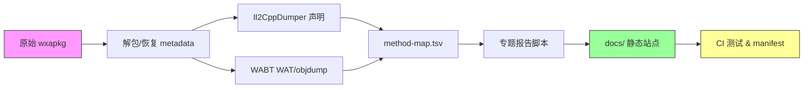

# 《占城大师》研究项目 Review 报告

> 审查范围：项目全部结构、8 份正式报告（docs/reports/）、逆向工程体系、56 个脚本、233 张配置表、CI 流程、自动化测试与发布站点。

---

## 总体评价

**这是一个工程质量极高、证据层次极为严谨的游戏系统逆向研究项目。** 在行业中能做到这种程度的系统性拆解和可追溯性的项目非常罕见。

### ✅ 亮点

| 维度 | 评价 |
|---|---|
| **证据分级** | 所有报告严格区分「画面确认」「静态配置」「代码还原」「设计推断」「待验证」五个等级，拒绝将客户端逻辑直接等同于线上行为 |
| **单一归属原则** | 跨专题结论（地块随机、匹配、Bot AI）有明确的唯一权威页，消除了多处维护漂移风险 |
| **可重复重建** | 从原始 `.wxapkg` 到最终 `dump.cs`、canonical WAT/objdump、method-map 的全链路使用 CI 固化，hash 校验完整 |
| **自动化测试** | 6 套 CJS 端对端测试覆盖页面渲染、交互、死链、溢出、敏感信息泄露等 |
| **报告完整度** | 8 大专题覆盖了系统、战斗、卡牌、新手路径、宝箱、地块随机、匹配与 Bot，各 20–180KB |
| **数据交叉校验** | 主动发现并标注了多处配置冲突（重甲盾卫品质、无头骑士/机械暴龙技能冷却、水晶数量等） |

---

## 🔴 需要修复的问题

### 1. 匹配报告 `report.md` 未闭合 HTML 注释（严重）

**文件**: [report.md](file:///f:/PC-AGENT/zhancheng-card-research/docs/reports/matching/report.md#L230)

第 230 行有一个 `<!--` 开始的 HTML 注释，但**从未关闭**（没有对应的 `-->`）。这导致**后续 10,739 行内容**（包括 7.6 节机器人 AI 行为分析和 86 套完整 JSON 载荷）在 Markdown/HTML 渲染器中**全部被当作注释吞掉**。

> [!CAUTION]
> 这个问题不影响 `index.html`（已编译的 HTML 正常），但会影响直接阅读 `report.md` 的人。如果 `report.md` 作为独立交付物或被其他工具解析，半数内容会消失。

**修复方案**：在第 230 行 `<!--` 前补上 `-->` 结束标签，或者（如果这些内容确实不再需要展示在 report.md 中）将被注释的废弃段落彻底删除。

---

### 2. 匹配页 `index.html` JS 报错（中等）

**文件**: [index.html](file:///f:/PC-AGENT/zhancheng-card-research/docs/reports/matching/index.html)

`test_public_site.cjs` 测试失败，报错信息：
```
reports/matching/index.html: Cannot read properties of null (reading 'addEventListener')
```

这意味着页面 JS 中某个 `document.querySelector()` 或 `document.getElementById()` 返回了 `null`，随后调用 `.addEventListener()` 抛出异常。该错误在 Playwright Edge 无头浏览器中复现。

**修复方案**：在 JS 中添加空值保护（`el?.addEventListener(…)`），或确认目标 DOM 元素 ID/选择器正确存在。

---

## 🟡 建议改进的问题

### 3. `outputs/update_player_state_reports.py` 位置不当

该 Python 脚本放在 `outputs/` 目录下，但项目所有其他脚本统一在 `scripts/`。建议移至 `scripts/` 以保持 `outputs/` 纯粹为数据产物目录。

### 4. `scripts/strip_reverse_commit_footer.py` 临时脚本未清理

该脚本头部明确标注 "*It is intentionally temporary and should be deleted after a successful migration run.*"，2026-09-11 迁移任务已闭环，但脚本仍存留。建议删除或归档。

### 5. `research/archive/2026-09-11/verify.ps1` 缺乏安全保护

README 中警示"不要对现有归档再次执行校验脚本，因为它会从实时源刷新不同内容"。建议在脚本头部添加 `--dry-run` 默认或参数保护，防止意外执行。

---

## 📊 报告质量逐项评估

| 报告 | 大小 | 质量 | 内容完整度 | 格式 | 备注 |
|---|---|---|---|---|---|
| [全系统拆解](file:///f:/PC-AGENT/zhancheng-card-research/docs/reports/system/report.md) | 80KB / 820行 | ⭐⭐⭐⭐⭐ | 覆盖局内、成长、局外全链路 | ✅ | 证据口径已对齐 9-11 基准 |
| [局内战斗规则](file:///f:/PC-AGENT/zhancheng-card-research/docs/reports/battle/report.md) | 14.6KB / 186行 | ⭐⭐⭐⭐⭐ | 经济、出兵、神器充能、20档竞技场 | ✅ | 地块内容正确引流至 hex-random |
| [全卡牌图鉴](file:///f:/PC-AGENT/zhancheng-card-research/docs/reports/cards/report.md) | 10KB / 95行 | ⭐⭐⭐⭐⭐ | 54张完整、品质冲突已标记 | ✅ | 配套 Excel 6 表、在线图鉴完整 |
| [新手全路径](file:///f:/PC-AGENT/zhancheng-card-research/docs/reports/journey/report.md) | 123KB / 1305行 | ⭐⭐⭐⭐⭐ | 116节点教程链全审计、SVG路径图 | ✅ | 明确标注了 A/B 测试分支不确定性 |
| [宝箱规则](file:///f:/PC-AGENT/zhancheng-card-research/docs/reports/chests/report.md) | 75KB / 2866行 | ⭐⭐⭐⭐⭐ | 8种宝箱全量、公式还原完整 | ✅ | 水晶配置冲突已主动定位 |
| [地块随机](file:///f:/PC-AGENT/zhancheng-card-research/docs/reports/hex-random/report.md) | 180KB / 437行 | ⭐⭐⭐⭐⭐ | 初始化链、SSSR权重、重抽规则完整 | ✅ | 纠正了旧报告多处错误 |
| [匹配与Bot](file:///f:/PC-AGENT/zhancheng-card-research/docs/reports/matching/report.md) | 249KB / 10969行 | ⭐⭐⭐⭐ | 搜索窗口、段位Bot参数、86套预设 | ⚠️ | L230 未闭合注释导致 MD 渲染缺损 |
| [Bot配置详表](file:///f:/PC-AGENT/zhancheng-card-research/docs/reports/matching/bot.html) | 762KB | ⭐⭐⭐⭐⭐ | 86套逐卡等级/技能/神器/AI行为 | ✅ | 交互筛选、移动端适配完善 |

---

## 🔍 已确认的已知边界（项目自身已标注）

项目在这些方面**已经明确声明了边界**，不算遗漏：

1. **86 套 PVP Bot 的最终抽取函数与服务端权重**：未恢复
2. **服务端是否用 `UserLabels` 做配对**：仅证实标签写入上传载荷，未证实服务端消费
3. **`data-package` 分包**：loader 记录 `loadDataPackageFromSubpackage=false`，非遗漏
4. **`wasmcode2 archive_value` 语义**：严格保留未证明状态
5. **平局/断线/特殊模式结算**：仅还原了标准结算入口

---

## 🏗️ 工程体系评价



- **CI 流程**完整：`rebuild-unified-reverse.yml` + `rebuild-matching-docs.yml`
- **hash 校验**覆盖全链路：raw → metadata → dump.cs → method-map → docs/manifest.json
- **测试覆盖**：6 套 CJS Playwright 测试 + 安全模式检查（本地路径泄露、凭据泄露）
- **依赖管理**：`tools/python/` vendor 化，`requirements.txt` 最小化

---

## ✅ 最终总结

| 项目 | 状态 |
|---|---|
| 必须修复 | 2 项（匹配 report.md 注释未闭合、matching index.html JS 报错） |
| 建议改进 | 3 项（脚本位置、临时文件清理、校验脚本保护） |
| 整体质量 | **优秀** — 工程严谨度、证据分级和可追溯性在同类项目中属于顶级水平 |
